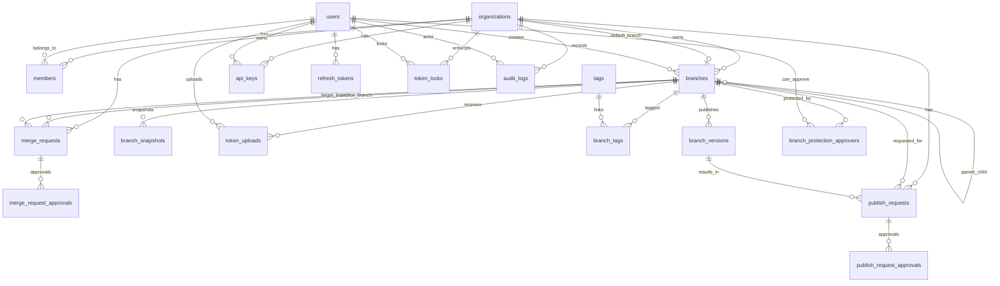

# Backend Database Schema and Data Model

This document describes the PostgreSQL data model currently defined in
`apps/backend/prisma/schema.prisma`.

Last validated against:

- Prisma schema: `apps/backend/prisma/schema.prisma`
- Migrations directory: `apps/backend/prisma/migrations`
- Validation command: `pnpm --dir apps/backend exec prisma validate`

Validation status:

- The schema is valid.
- Prisma validation is clean with no referential-action warnings.

Documentation scope:

- `schema.prisma` is the source of truth for physical schema shape, Prisma enum members, relations, and field mappings.
- This document is a maintained engineering reference for business meaning, constraints, migration context, and stored database values.
- When this document and `schema.prisma` disagree, treat `schema.prisma` as authoritative and update this file.

## Modeling Standards

- PostgreSQL is the only backing store for backend domain data.
- Prisma models use camelCase field names in TypeScript and `snake_case` table/column names through `@@map` and `@map`.
- Core entity IDs are UUIDs (`@db.Uuid`) generated by Prisma `uuid()`.
- Multi-tenant resources are scoped to `organizations` where applicable.
- Soft delete is used only for `users.deleted_at` and `branches.deleted_at`.
- Audit logs and branch versions are append-oriented history tables.
- JSONB is used for token configs, diffs, lock violations, parsed uploads, and audit metadata.
- Database enums enforce role, lifecycle, upload, request, and audit action values.

## Migration History

| Migration                                    | Purpose                                                                                                                                                       |
| -------------------------------------------- | ------------------------------------------------------------------------------------------------------------------------------------------------------------- |
| `20260415173323_init_org_optional`           | Initial users, organizations, branches, versions, snapshots, uploads, tags, API keys, refresh tokens, and audit logs.                                         |
| `20260417000000_rename_actor_email_hash`     | Renamed `audit_logs.actor_email` to `actor_email_hash` and constrained it to SHA-256 hash length.                                                             |
| `20260417190514_add_merge_requests_table`    | Added token locks and merge requests, plus governance/audit enum values.                                                                                      |
| `20260522070203_add_approval_workflow`       | Added approval workflow fields, merge request approvals, publish requests, publish request approvals, and branch protection fields.                           |
| `20260522120000_harden_approval_schema`      | Added native request status enums, normalized branch protection approvers, renamed old columns, converted `default_branch_id` to UUID, and added missing FKs. |
| `20260525090000_production_schema_hardening` | Added organization policy enums, nullable `SET NULL` actor FKs, and an enforced branch parent self-FK.                                                        |

## ER Overview

## Enums

### `UserRole`

- `admin`
- `editor`
- `viewer`

Used by both `users.system_role` and `members.org_role`.

### `BranchStatus`

- `draft`
- `published`
- `archived`

### `BranchVisibility`

- `private`
- `team`
- `public`

### `UploadStatus`

- `pending`
- `processing`
- `valid`
- `invalid`

### `WcagEnforcement`

- `none`
- `warn`
- `block`

### `AllowedApprovers`

Stored PostgreSQL enum values:

- `admins`
- `admins-and-editors`
- `custom`

Prisma client enum members:

- `admins`
- `admins_and_editors`
- `custom`

`admins_and_editors` is mapped to the stored PostgreSQL value
`admins-and-editors` via `@map("admins-and-editors")`.

### `MergeRequestStatus`

- `pending`
- `approved`
- `rejected`
- `merged`
- `cancelled`

### `PublishRequestStatus`

- `pending`
- `approved`
- `rejected`
- `published`
- `cancelled`

### `AuditAction`

- `branch_created`
- `branch_updated`
- `branch_deleted`
- `branch_published`
- `branch_archived`
- `branch_forked`
- `version_created`
- `snapshot_created`
- `snapshot_restored`
- `token_uploaded`
- `user_created`
- `user_role_changed`
- `user_deactivated`
- `api_key_created`
- `api_key_revoked`
- `member_invited`
- `member_removed`
- `token_locked`
- `token_unlocked`
- `merge_request_created`
- `merge_request_approved`
- `merge_request_rejected`
- `merge_request_merged`
- `merge_request_merged_admin_bypass`
- `publish_request_created`
- `publish_request_approved`
- `publish_request_rejected`
- `publish_request_cancelled`
- `publish_request_published`
- `publish_request_published_admin_bypass`
- `organization_settings_updated`
- `branch_protection_enabled`
- `branch_protection_updated`
- `branch_protection_disabled`

## Table Specifications

## `organizations`

Purpose: tenant root and default governance policy.

| Column                         | Type               | Null | Default      | Notes                                     |
| ------------------------------ | ------------------ | ---: | ------------ | ----------------------------------------- |
| `id`                           | UUID               |   No | `uuid()`     | Primary key                               |
| `name`                         | varchar(255)       |   No | -            | Display name                              |
| `slug`                         | varchar(100)       |   No | -            | Unique org slug                           |
| `default_branch_id`            | UUID               |  Yes | `NULL`       | FK to `branches.id`, `ON DELETE SET NULL` |
| `blend_version`                | varchar(50)        |  Yes | `NULL`       | Blend package/library version             |
| `wcag_enforcement`             | `WcagEnforcement`  |   No | `warn`       | DB-enforced accessibility policy          |
| `require_approval_for_merge`   | boolean            |   No | `true`       | Default merge workflow policy             |
| `require_approval_for_publish` | boolean            |   No | `false`      | Default publish workflow policy           |
| `allowed_approvers`            | `AllowedApprovers` |   No | `admins`     | DB-enforced approval-role policy          |
| `min_approvals`                | int                |   No | `1`          | Default approval threshold                |
| `allow_admin_bypass`           | boolean            |   No | `true`       | Allows admin bypass in approval workflows |
| `created_at`                   | timestamp          |   No | `now()`      | Creation timestamp                        |
| `updated_at`                   | timestamp          |   No | `@updatedAt` | Update timestamp                          |

Constraints and indexes:

- PK: `id`
- Unique: `slug`

Relationships:

- 1:N `members`, `branches`, `api_keys`, `audit_logs`, `token_locks`, `merge_requests`, `publish_requests`
- Optional N:1 default branch through `default_branch_id`

## `members`

Purpose: maps users to organizations and stores organization-specific role.

| Column            | Type       | Null | Default  | Notes                                         |
| ----------------- | ---------- | ---: | -------- | --------------------------------------------- |
| `id`              | UUID       |   No | `uuid()` | Primary key                                   |
| `organization_id` | UUID       |   No | -        | FK to `organizations.id`, `ON DELETE CASCADE` |
| `user_id`         | UUID       |   No | -        | FK to `users.id`, `ON DELETE CASCADE`         |
| `org_role`        | `UserRole` |   No | `viewer` | Organization role                             |
| `joined_at`       | timestamp  |   No | `now()`  | Join timestamp                                |

Constraints and indexes:

- PK: `id`
- Unique: (`organization_id`, `user_id`)
- Index: `user_id`

## `users`

Purpose: identity, profile, global role, and account lifecycle.

| Column         | Type         | Null | Default      | Notes                                     |
| -------------- | ------------ | ---: | ------------ | ----------------------------------------- |
| `id`           | UUID         |   No | `uuid()`     | Primary key                               |
| `google_id`    | varchar(255) |  Yes | `NULL`       | Google OAuth subject, unique when present |
| `email`        | varchar(255) |   No | -            | Unique login identity                     |
| `display_name` | varchar(255) |  Yes | `NULL`       | Profile display name                      |
| `photo_url`    | text         |  Yes | `NULL`       | Avatar URL                                |
| `system_role`  | `UserRole`   |   No | `viewer`     | Global backend role                       |
| `is_active`    | boolean      |   No | `true`       | Active account flag                       |
| `created_at`   | timestamp    |   No | `now()`      | Creation timestamp                        |
| `updated_at`   | timestamp    |   No | `@updatedAt` | Update timestamp                          |
| `last_login`   | timestamp    |  Yes | `NULL`       | Last successful login                     |
| `deleted_at`   | timestamp    |  Yes | `NULL`       | Soft delete marker                        |

Constraints and indexes:

- PK: `id`
- Unique: `google_id`, `email`
- Index: `email`, `deleted_at`

Relationships:

- 1:N `refresh_tokens`, `token_uploads`, `members`, `api_keys`, created `branches`, `audit_logs`, `token_locks`, `branch_protection_approvers`

## `refresh_tokens`

Purpose: stores hashed refresh tokens for browser sessions.

| Column       | Type         | Null | Default  | Notes                                 |
| ------------ | ------------ | ---: | -------- | ------------------------------------- |
| `id`         | UUID         |   No | `uuid()` | Primary key                           |
| `user_id`    | UUID         |   No | -        | FK to `users.id`, `ON DELETE CASCADE` |
| `token_hash` | varchar(255) |   No | -        | Unique hash of refresh token          |
| `expires_at` | timestamp    |   No | -        | Expiration timestamp                  |
| `created_at` | timestamp    |   No | `now()`  | Creation timestamp                    |

Constraints and indexes:

- PK: `id`
- Unique: `token_hash`
- Index: `user_id`, `token_hash`, `expires_at`

## `api_keys`

Purpose: CLI/API keys scoped to an organization and user.

| Column            | Type         | Null | Default  | Notes                                         |
| ----------------- | ------------ | ---: | -------- | --------------------------------------------- |
| `id`              | UUID         |   No | `uuid()` | Primary key                                   |
| `organization_id` | UUID         |   No | -        | FK to `organizations.id`, `ON DELETE CASCADE` |
| `user_id`         | UUID         |   No | -        | FK to `users.id`, `ON DELETE CASCADE`         |
| `name`            | varchar(255) |   No | -        | Human-readable key name                       |
| `key_hash`        | varchar(255) |   No | -        | Unique hash of API key                        |
| `key_prefix`      | varchar(8)   |   No | -        | Display-safe prefix                           |
| `last_used_at`    | timestamp    |  Yes | `NULL`   | Last use timestamp                            |
| `expires_at`      | timestamp    |  Yes | `NULL`   | Optional expiration                           |
| `created_at`      | timestamp    |   No | `now()`  | Creation timestamp                            |
| `revoked_at`      | timestamp    |  Yes | `NULL`   | Revocation timestamp                          |

Constraints and indexes:

- PK: `id`
- Unique: `key_hash`
- Index: `key_hash`, `organization_id`, `user_id`, `revoked_at`

## `branches`

Purpose: versioned token configuration with lifecycle, inheritance, and protection controls.

| Column                        | Type               | Null | Default      | Notes                                                                         |
| ----------------------------- | ------------------ | ---: | ------------ | ----------------------------------------------------------------------------- |
| `id`                          | UUID               |   No | `uuid()`     | Primary key                                                                   |
| `organization_id`             | UUID               |  Yes | `NULL`       | FK to `organizations.id`, `ON DELETE CASCADE`; nullable for personal branches |
| `branch_slug`                 | varchar(255)       |   No | -            | Unique branch identifier                                                      |
| `name`                        | varchar(255)       |   No | -            | Display name                                                                  |
| `description`                 | text               |  Yes | `NULL`       | Optional description                                                          |
| `parent_branch_id`            | UUID               |  Yes | `NULL`       | Self-FK to `branches.id`, `ON DELETE SET NULL`, for inheritance               |
| `status`                      | `BranchStatus`     |   No | `draft`      | Lifecycle state                                                               |
| `visibility`                  | `BranchVisibility` |   No | `private`    | Access visibility                                                             |
| `token_config`                | jsonb              |   No | -            | Full token configuration payload                                              |
| `published_versions`          | int                |   No | `0`          | Published version counter                                                     |
| `latest_version`              | varchar(50)        |  Yes | `NULL`       | Latest published semantic version                                             |
| `is_protected`                | boolean            |   No | `false`      | Branch protection flag                                                        |
| `protection_require_approval` | boolean            |  Yes | `NULL`       | Branch-level approval override                                                |
| `protection_min_approvals`    | int                |  Yes | `NULL`       | Branch-level approval threshold override                                      |
| `created_by`                  | UUID               |   No | -            | FK to `users.id`, `ON DELETE CASCADE`                                         |
| `created_by_name`             | varchar(255)       |   No | -            | Creator display name snapshot                                                 |
| `created_at`                  | timestamp          |   No | `now()`      | Creation timestamp                                                            |
| `updated_at`                  | timestamp          |   No | `@updatedAt` | Update timestamp                                                              |
| `deleted_at`                  | timestamp          |  Yes | `NULL`       | Soft delete marker                                                            |

Constraints and indexes:

- PK: `id`
- Unique: `branch_slug`
- Index: `organization_id`, `created_by`, `parent_branch_id`, `status`, `visibility`, `is_protected`, `updated_at`, `deleted_at`, `branch_slug`

Relationships:

- N:1 `organizations`, N:1 creator `users`, optional N:1 parent `branches`
- 1:N `branch_versions`, `branch_snapshots`, `token_uploads`, `branch_tags`, `branch_protection_approvers`, source/target `merge_requests`, `publish_requests`
- 1:N reverse relation from `organizations.default_branch_id`

## `branch_versions`

Purpose: immutable published token config snapshots.

| Column              | Type         | Null | Default  | Notes                                    |
| ------------------- | ------------ | ---: | -------- | ---------------------------------------- |
| `id`                | UUID         |   No | `uuid()` | Primary key                              |
| `branch_id`         | UUID         |   No | -        | FK to `branches.id`, `ON DELETE CASCADE` |
| `version`           | varchar(50)  |   No | -        | Version string                           |
| `token_config`      | jsonb        |   No | -        | Published token config                   |
| `changelog`         | text         |  Yes | `NULL`   | Release notes                            |
| `is_breaking`       | boolean      |   No | `false`  | Breaking-change flag                     |
| `is_prerelease`     | boolean      |   No | `false`  | Prerelease flag                          |
| `published_by`      | UUID         |   No | -        | Publisher user ID snapshot               |
| `published_by_name` | varchar(255) |   No | -        | Publisher display name snapshot          |
| `published_at`      | timestamp    |   No | `now()`  | Publish timestamp                        |

Constraints and indexes:

- PK: `id`
- Unique: (`branch_id`, `version`)
- Index: `branch_id`, `published_at`, (`branch_id`, `published_at`)

## `branch_snapshots`

Purpose: manual and autosave editor checkpoints.

| Column          | Type         | Null | Default  | Notes                                    |
| --------------- | ------------ | ---: | -------- | ---------------------------------------- |
| `id`            | UUID         |   No | `uuid()` | Primary key                              |
| `branch_id`     | UUID         |   No | -        | FK to `branches.id`, `ON DELETE CASCADE` |
| `token_config`  | jsonb        |   No | -        | Saved token config                       |
| `label`         | varchar(255) |  Yes | `NULL`   | Optional snapshot label                  |
| `is_auto_save`  | boolean      |   No | `false`  | Autosave marker                          |
| `saved_by`      | UUID         |   No | -        | Saver user ID snapshot                   |
| `saved_by_name` | varchar(255) |   No | -        | Saver display name snapshot              |
| `saved_at`      | timestamp    |   No | `now()`  | Save timestamp                           |

Constraints and indexes:

- PK: `id`
- Index: `branch_id`, `saved_at`, (`branch_id`, `saved_at`)

## `tags`

Purpose: reusable labels for branches.

| Column       | Type         | Null | Default  | Notes              |
| ------------ | ------------ | ---: | -------- | ------------------ |
| `id`         | UUID         |   No | `uuid()` | Primary key        |
| `name`       | varchar(100) |   No | -        | Unique tag name    |
| `created_at` | timestamp    |   No | `now()`  | Creation timestamp |

Constraints and indexes:

- PK: `id`
- Unique: `name`

## `branch_tags`

Purpose: many-to-many join between branches and tags.

| Column      | Type | Null | Default | Notes                                    |
| ----------- | ---- | ---: | ------- | ---------------------------------------- |
| `branch_id` | UUID |   No | -       | FK to `branches.id`, `ON DELETE CASCADE` |
| `tag_id`    | UUID |   No | -       | FK to `tags.id`, `ON DELETE CASCADE`     |

Constraints and indexes:

- Composite PK: (`branch_id`, `tag_id`)
- Index: `tag_id`

## `token_uploads`

Purpose: uploaded token JSON files and parsed validation state.

| Column             | Type           | Null | Default      | Notes                                                                         |
| ------------------ | -------------- | ---: | ------------ | ----------------------------------------------------------------------------- |
| `id`               | UUID           |   No | `uuid()`     | Primary key                                                                   |
| `branch_id`        | UUID           |   No | -            | FK to `branches.id`, `ON DELETE CASCADE`                                      |
| `file_name`        | varchar(255)   |   No | -            | Original upload file name                                                     |
| `file_size`        | int            |   No | -            | Size in bytes                                                                 |
| `description`      | text           |  Yes | `NULL`       | Optional upload description                                                   |
| `parsed_config`    | jsonb          |  Yes | `NULL`       | Parsed config when available                                                  |
| `status`           | `UploadStatus` |   No | `pending`    | Processing/validation state                                                   |
| `uploaded_by`      | UUID           |  Yes | `NULL`       | FK to `users.id`, `ON DELETE SET NULL`; upload history survives user deletion |
| `uploaded_by_name` | varchar(255)   |   No | -            | Uploader display name snapshot                                                |
| `created_at`       | timestamp      |   No | `now()`      | Creation timestamp                                                            |
| `updated_at`       | timestamp      |   No | `@updatedAt` | Update timestamp                                                              |

Constraints and indexes:

- PK: `id`
- Index: `branch_id`, `uploaded_by`, `status`, `created_at`

## `token_locks`

Purpose: organization-level token paths that child branches cannot override.

| Column            | Type         | Null | Default  | Notes                                         |
| ----------------- | ------------ | ---: | -------- | --------------------------------------------- |
| `id`              | UUID         |   No | `uuid()` | Primary key                                   |
| `organization_id` | UUID         |   No | -        | FK to `organizations.id`, `ON DELETE CASCADE` |
| `token_path`      | varchar(500) |   No | -        | Dot path such as `colors.primary.500`         |
| `reason`          | text         |  Yes | `NULL`   | Optional governance reason                    |
| `locked_by`       | UUID         |  Yes | `NULL`   | FK to `users.id`, `ON DELETE SET NULL`        |
| `created_at`      | timestamp    |   No | `now()`  | Creation timestamp                            |

Constraints and indexes:

- PK: `id`
- Unique: (`organization_id`, `token_path`)
- Index: `organization_id`

## `merge_requests`

Purpose: approval workflow for merging branch changes into a target branch.

| Column               | Type                 | Null | Default      | Notes                                                                              |
| -------------------- | -------------------- | ---: | ------------ | ---------------------------------------------------------------------------------- |
| `id`                 | UUID                 |   No | `uuid()`     | Primary key                                                                        |
| `organization_id`    | UUID                 |  Yes | `NULL`       | FK to `organizations.id`, `ON DELETE CASCADE`; nullable for personal/non-org flows |
| `source_branch_id`   | UUID                 |   No | -            | FK to source `branches.id`, `ON DELETE CASCADE`                                    |
| `source_branch_name` | varchar(255)         |   No | -            | Source branch name snapshot                                                        |
| `target_branch_id`   | UUID                 |   No | -            | FK to target `branches.id`, `ON DELETE CASCADE`                                    |
| `target_branch_name` | varchar(255)         |   No | -            | Target branch name snapshot                                                        |
| `title`              | varchar(255)         |   No | -            | Request title                                                                      |
| `description`        | text                 |  Yes | `NULL`       | Optional request description                                                       |
| `status`             | `MergeRequestStatus` |   No | `pending`    | Workflow state                                                                     |
| `diff`               | jsonb                |   No | -            | Computed source/target diff                                                        |
| `lock_violations`    | jsonb                |  Yes | `NULL`       | Token lock violations                                                              |
| `requested_by`       | UUID                 |   No | -            | Requester user ID snapshot                                                         |
| `reviewed_by`        | UUID                 |  Yes | `NULL`       | Reviewer user ID snapshot                                                          |
| `reviewed_at`        | timestamp            |  Yes | `NULL`       | Review timestamp                                                                   |
| `review_comment`     | text                 |  Yes | `NULL`       | Reviewer comment                                                                   |
| `merged_at`          | timestamp            |  Yes | `NULL`       | Merge execution timestamp                                                          |
| `created_at`         | timestamp            |   No | `now()`      | Creation timestamp                                                                 |
| `updated_at`         | timestamp            |   No | `@updatedAt` | Update timestamp                                                                   |

Constraints and indexes:

- PK: `id`
- Index: `organization_id`, `status`, `source_branch_id`, `target_branch_id`, `requested_by`

## `merge_request_approvals`

Purpose: per-user approvals for merge requests.

| Column             | Type         | Null | Default  | Notes                                          |
| ------------------ | ------------ | ---: | -------- | ---------------------------------------------- |
| `id`               | UUID         |   No | `uuid()` | Primary key                                    |
| `merge_request_id` | UUID         |   No | -        | FK to `merge_requests.id`, `ON DELETE CASCADE` |
| `user_id`          | UUID         |   No | -        | Approver user ID snapshot                      |
| `user_name`        | varchar(255) |   No | -        | Approver display name snapshot                 |
| `user_role`        | varchar(50)  |   No | -        | Role snapshot when approval was recorded       |
| `approved_at`      | timestamp    |   No | `now()`  | Approval timestamp                             |

Constraints and indexes:

- PK: `id`
- Unique: (`merge_request_id`, `user_id`)
- Index: `merge_request_id`, `user_id`

## `publish_requests`

Purpose: approval workflow for publishing branch versions.

| Column                 | Type                   | Null | Default      | Notes                                                                              |
| ---------------------- | ---------------------- | ---: | ------------ | ---------------------------------------------------------------------------------- |
| `id`                   | UUID                   |   No | `uuid()`     | Primary key                                                                        |
| `organization_id`      | UUID                   |  Yes | `NULL`       | FK to `organizations.id`, `ON DELETE CASCADE`; nullable for personal/non-org flows |
| `branch_id`            | UUID                   |   No | -            | FK to `branches.id`, `ON DELETE CASCADE`                                           |
| `branch_name`          | varchar(255)           |   No | -            | Branch name snapshot                                                               |
| `version`              | varchar(50)            |   No | -            | Requested version                                                                  |
| `changelog`            | text                   |  Yes | `NULL`       | Release notes                                                                      |
| `is_breaking`          | boolean                |   No | `false`      | Breaking-change flag                                                               |
| `is_prerelease`        | boolean                |   No | `false`      | Prerelease flag                                                                    |
| `status`               | `PublishRequestStatus` |   No | `pending`    | Workflow state                                                                     |
| `requested_by`         | UUID                   |   No | -            | Requester user ID snapshot                                                         |
| `requested_by_name`    | varchar(255)           |   No | -            | Requester display name snapshot                                                    |
| `review_comment`       | text                   |  Yes | `NULL`       | Reviewer comment                                                                   |
| `published_version_id` | UUID                   |  Yes | `NULL`       | FK to `branch_versions.id`, `ON DELETE SET NULL`                                   |
| `published_at`         | timestamp              |  Yes | `NULL`       | Publish execution timestamp                                                        |
| `created_at`           | timestamp              |   No | `now()`      | Creation timestamp                                                                 |
| `updated_at`           | timestamp              |   No | `@updatedAt` | Update timestamp                                                                   |

Constraints and indexes:

- PK: `id`
- Index: `organization_id`, `branch_id`, `status`, `requested_by`

## `branch_protection_approvers`

Purpose: normalized approver allow-list for protected branches.

| Column       | Type      | Null | Default | Notes                                    |
| ------------ | --------- | ---: | ------- | ---------------------------------------- |
| `branch_id`  | UUID      |   No | -       | FK to `branches.id`, `ON DELETE CASCADE` |
| `user_id`    | UUID      |   No | -       | FK to `users.id`, `ON DELETE CASCADE`    |
| `created_at` | timestamp |   No | `now()` | Creation timestamp                       |

Constraints and indexes:

- Composite PK: (`branch_id`, `user_id`)
- Index: `user_id`

## `publish_request_approvals`

Purpose: per-user approvals for publish requests.

| Column               | Type         | Null | Default  | Notes                                            |
| -------------------- | ------------ | ---: | -------- | ------------------------------------------------ |
| `id`                 | UUID         |   No | `uuid()` | Primary key                                      |
| `publish_request_id` | UUID         |   No | -        | FK to `publish_requests.id`, `ON DELETE CASCADE` |
| `user_id`            | UUID         |   No | -        | Approver user ID snapshot                        |
| `user_name`          | varchar(255) |   No | -        | Approver display name snapshot                   |
| `user_role`          | varchar(50)  |   No | -        | Role snapshot when approval was recorded         |
| `approved_at`        | timestamp    |   No | `now()`  | Approval timestamp                               |

Constraints and indexes:

- PK: `id`
- Unique: (`publish_request_id`, `user_id`)
- Index: `publish_request_id`, `user_id`

## `audit_logs`

Purpose: immutable audit trail for organization-scoped mutations.

| Column             | Type          | Null | Default  | Notes                                                                        |
| ------------------ | ------------- | ---: | -------- | ---------------------------------------------------------------------------- |
| `id`               | UUID          |   No | `uuid()` | Primary key                                                                  |
| `organization_id`  | UUID          |   No | -        | FK to `organizations.id`, `ON DELETE CASCADE`                                |
| `action`           | `AuditAction` |   No | -        | Mutation/action type                                                         |
| `actor_id`         | UUID          |  Yes | `NULL`   | FK to `users.id`, `ON DELETE SET NULL`; audit history survives user deletion |
| `actor_email_hash` | varchar(64)   |   No | -        | SHA-256 hash of actor email, not plaintext                                   |
| `target_type`      | varchar(50)   |   No | -        | Target resource type                                                         |
| `target_id`        | UUID          |   No | -        | Target resource UUID                                                         |
| `metadata`         | jsonb         |  Yes | `NULL`   | Action-specific metadata; must avoid plaintext PII                           |
| `created_at`       | timestamp     |   No | `now()`  | Creation timestamp                                                           |

Constraints and indexes:

- PK: `id`
- Index: `organization_id`, `action`, `actor_id`, (`target_type`, `target_id`), `created_at`, (`organization_id`, `created_at`)

## Important Schema Notes

- `members.org_role` and `users.system_role` intentionally separate organization-level authorization from global/system authorization.
- `branches.branch_slug` replaced the older `brand_id` physical column.
- `token_config` replaced the older `brand_config` physical column on branches, versions, and snapshots.
- `branch_protection_approvers` replaced the older denormalized `protection_allowed_approvers` CSV field.
- `organizations.default_branch_id` is a UUID FK to `branches.id`.
- `organizations.wcag_enforcement` and `organizations.allowed_approvers` are native PostgreSQL enums.
- `AllowedApprovers.admins_and_editors` is the Prisma enum member; `admins-and-editors` is the stored PostgreSQL value.
- `branches.parent_branch_id` is an enforced optional self-reference for inheritance.
- `merge_requests.status` and `publish_requests.status` are native PostgreSQL enums, not plain varchar fields.
- `AuditLog.actorEmailHash` must be written with a hashed email. The repository layer is responsible for hashing before persistence.
