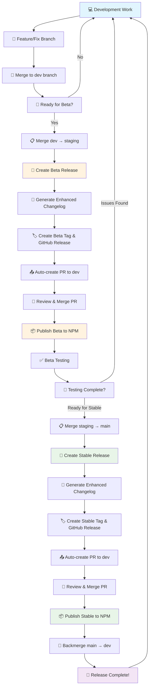

# 🔄 Release Workflow Flowchart

## 📊 Complete Workflow Overview



## 🌊 Detailed Process Flow

### 🔵 Development Phase

```
┌─────────────────┐    ┌─────────────────┐    ┌─────────────────┐
│   Development   │───▶│   dev Branch    │───▶│ Ready for Beta? │
│      Work       │    │   Integration   │    │   (staging)     │
└─────────────────┘    └─────────────────┘    └─────────────────┘
```

### 🟡 Beta Release Phase

```
┌─────────────────┐    ┌─────────────────┐    ┌─────────────────┐
│ Create Beta     │───▶│ Enhanced        │───▶│ GitHub Beta     │
│ Release (GitHub)│    │ Changelog Gen   │    │ Release Created │
└─────────────────┘    └─────────────────┘    └─────────────────┘
          │                                             │
          ▼                                             ▼
┌─────────────────┐    ┌─────────────────┐    ┌─────────────────┐
│ Version Bump    │───▶│ Auto-create PR  │───▶│ Review & Merge  │
│ (X.Y.Z-beta)    │    │ to dev branch   │    │ PR to dev       │
└─────────────────┘    └─────────────────┘    └─────────────────┘
                                                        │
                                                        ▼
┌─────────────────┐    ┌─────────────────┐    ┌─────────────────┐
│ Beta Testing    │◀───│ Publish Beta    │◀───│ NPM Publish     │
│ & Validation    │    │ to NPM (manual) │    │ Confirmation    │
└─────────────────┘    └─────────────────┘    └─────────────────┘
```

### 🟢 Stable Release Phase

```
┌─────────────────┐    ┌─────────────────┐    ┌─────────────────┐
│ Testing Pass?   │───▶│ Create Stable   │───▶│ Enhanced        │
│ staging → main  │    │ Release (GitHub)│    │ Changelog Gen   │
└─────────────────┘    └─────────────────┘    └─────────────────┘
          │                      │                      │
          ▼                      ▼                      ▼
┌─────────────────┐    ┌─────────────────┐    ┌─────────────────┐
│ Convert Beta    │───▶│ GitHub Stable   │───▶│ Auto-create PR  │
│ to Stable Ver   │    │ Release Created │    │ to dev branch   │
└─────────────────┘    └─────────────────┘    └─────────────────┘
                                                        │
                                                        ▼
┌─────────────────┐    ┌─────────────────┐    ┌─────────────────┐
│ Backmerge       │◀───│ Publish Stable  │◀───│ Review & Merge  │
│ main → dev      │    │ to NPM (manual) │    │ PR to dev       │
└─────────────────┘    └─────────────────┘    └─────────────────┘
```

## 🎯 Workflow Decision Points

### ❓ Key Decision Gates

| Stage              | Question          | Yes →             | No →                 |
| ------------------ | ----------------- | ----------------- | -------------------- |
| **Development**    | Ready for Beta?   | Merge to staging  | Continue development |
| **Beta Testing**   | Testing Complete? | Proceed to stable | Fix issues & retry   |
| **Stable Release** | All checks pass?  | Publish to NPM    | Debug & retry        |

## 🏃‍♂️ Manual Action Points

### 👤 Developer Actions Required

1. **🎯 Trigger Workflows**
    - Create Beta Release (from staging)
    - Publish Beta to NPM (type "PUBLISH")
    - Create Stable Release (from main, type "STABLE")
    - Publish Stable to NPM (type "PUBLISH")

2. **👀 Review & Merge**
    - Review auto-generated PRs
    - Merge PRs to dev branch
    - Verify changelog accuracy

3. **🧪 Testing**
    - Test beta versions thoroughly
    - Validate functionality before stable release

## 🛡️ Safety Checkpoints

### ✅ Automated Validations

```
┌─────────────────┐    ┌─────────────────┐    ┌─────────────────┐
│ Branch Check    │───▶│ Version Format  │───▶│ NPM Auth Test   │
│ (staging/main)  │    │ Validation      │    │ & Token Check   │
└─────────────────┘    └─────────────────┘    └─────────────────┘
          │                      │                      │
          ▼                      ▼                      ▼
┌─────────────────┐    ┌─────────────────┐    ┌─────────────────┐
│ Existing Ver    │───▶│ Build Success   │───▶│ Publish Success │
│ Check on NPM    │    │ Validation      │    │ Verification    │
└─────────────────┘    └─────────────────┘    └─────────────────┘
```

## 📋 Branch Strategy Visual

```
main branch (stable releases)
    ↑
    │ (manual merge after testing)
    │
staging branch (beta releases)
    ↑
    │ (manual merge when ready)
    │
dev branch (active development)
    ↑
    │ (feature branches merge here)
    │
feature branches
```

## 📦 Release Artifacts Generated

### 🏷️ For Each Release

| Artifact           | Beta Release       | Stable Release     |
| ------------------ | ------------------ | ------------------ |
| **GitHub Release** | ✅ Prerelease flag | ✅ Stable release  |
| **NPM Package**    | ✅ `@beta` tag     | ✅ `@latest` tag   |
| **Changelog**      | ✅ Enhanced format | ✅ Enhanced format |
| **Git Tag**        | ✅ `vX.Y.Z-beta`   | ✅ `vX.Y.Z`        |
| **Auto PR**        | ✅ To dev branch   | ✅ To dev branch   |

## 🔄 Continuous Cycle

```
    Development → Beta → Testing → Stable → Backmerge
         ↑                                      │
         └──────────────────────────────────────┘
              Next development cycle
```

## 🚀 Quick Commands Reference

### Beta Release

```bash
# 1. Ensure code is in staging
git checkout staging && git pull

# 2. GitHub Actions: "Create Beta Release"
# 3. Review PR → Merge to dev
# 4. GitHub Actions: "Publish Beta to NPM" → Type "PUBLISH"
```

### Stable Release

```bash
# 1. Ensure code is in main
git checkout main && git pull

# 2. GitHub Actions: "Create Stable Release" → Type "STABLE"
# 3. Review PR → Merge to dev
# 4. GitHub Actions: "Publish Stable to NPM" → Type "PUBLISH"
```

---

This flowchart provides a complete visual overview of the enhanced release workflow, showing all decision points, manual actions, and automated processes! 🎉
