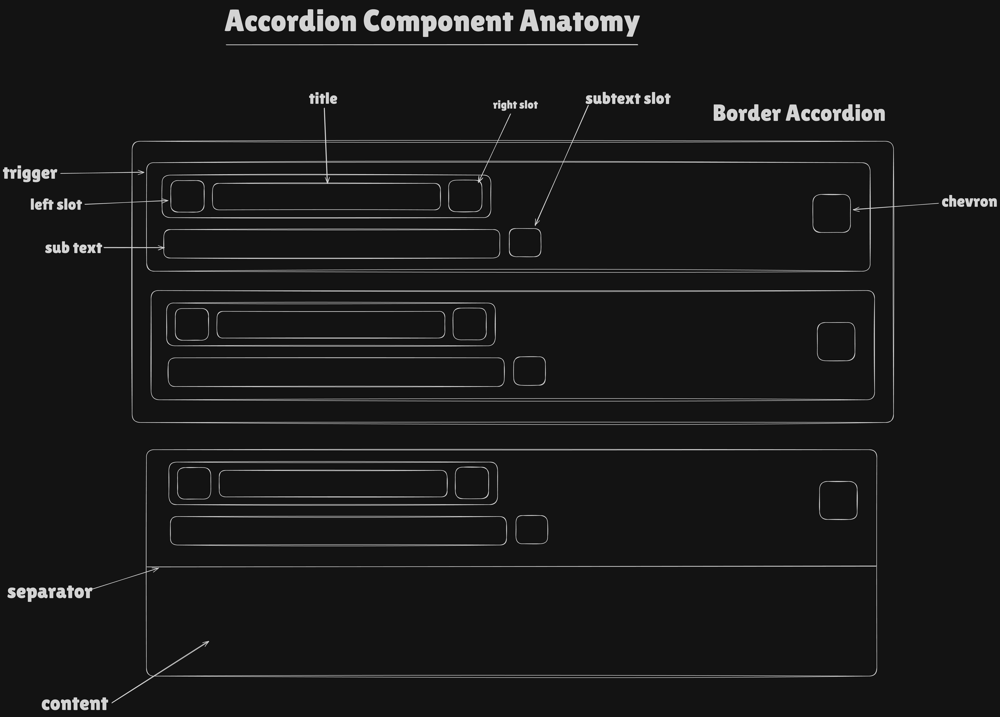

# AccordionV2 Component Documentation

## Requirements

Create a scalable accordion component that can display:

- **Title**: Required primary text content for each accordion item
- **Subtext**: Optional secondary text content displayed below title
- **Left Slot**: Optional icon or ReactElement displayed on the left side of the trigger
- **Right Slot**: Optional icon or ReactElement displayed on the right side of the trigger
- **Subtext Slot**: Optional custom ReactElement displayed as subtext
- **Chevron Position**: Configurable chevron icon position (left or right)
- **Single or Multiple Selection**: Support for single item expansion (collapsible) or multiple item expansion
- **Controlled and Uncontrolled Modes**: Support for both controlled (value prop) and uncontrolled (defaultValue prop) usage
- **Two Visual Styles**: Support for border and no-border accordion types
- **Disabled State**: Individual items can be disabled
- **Responsive Design**: Support for different breakpoints (sm, lg)
- **Accessibility**: Full ARIA support with proper roles, states, and keyboard navigation
- **Theme Support**: Light and dark mode token support

## Anatomy

```
┌─────────────────────────────────────────────────────────────┐
│ [Chevron] [LeftSlot] [Title] [RightSlot]                   │
│            [Subtext/SubtextSlot]                            │
├─────────────────────────────────────────────────────────────┤
│ [Separator] (BORDER type only)                              │
│ [Content]                                                    │
└─────────────────────────────────────────────────────────────┘
```



- **Container**: Main flex container with configurable width, border radius, and gap
- **Accordion Item**: Individual accordion section container with border and background styling
- **Trigger**: Clickable button element containing title, subtext, slots, and chevron
- **Chevron**: Animated icon indicating expand/collapse state
- **Left Slot**: Optional icon container positioned before title
- **Title**: Required text content displayed as primary heading
- **Right Slot**: Optional content container positioned after title
- **Subtext**: Optional secondary text displayed below title
- **Separator**: Horizontal divider for BORDER type (visible when expanded)
- **Content**: Expandable content area containing children elements

## Props & Types

```typescript
enum AccordionV2Type {
    BORDER = 'border',
    NO_BORDER = 'noBorder',
}

enum AccordionV2ChevronPosition {
    LEFT = 'left',
    RIGHT = 'right',
}

type AccordionV2ItemProps = {
    value: string
    title: string
    subtext?: string
    leftSlot?: ReactNode
    rightSlot?: ReactNode
    subtextSlot?: ReactNode
    children: ReactNode
    isDisabled?: boolean
    chevronPosition?: AccordionV2ChevronPosition
}

type AccordionV2Dimensions = {
    width?: CSSObject['width']
    maxWidth?: CSSObject['maxWidth']
    minWidth?: CSSObject['minWidth']
}

type AccordionV2Props = {
    children: ReactNode
    accordionType?: AccordionV2Type
    defaultValue?: string | string[]
    value?: string | string[]
    isMultiple?: boolean
    onValueChange?: (value: string | string[]) => void
} & AccordionV2Dimensions
```

## Final Token Type

```typescript
type AccordionV2State = 'default' | 'hover' | 'active' | 'disabled' | 'open'

type AccordionV2TokensType = {
    gap: { [key in AccordionV2Type]: CSSObject['gap'] }
    borderRadius: { [key in AccordionV2Type]: CSSObject['borderRadius'] }
    trigger: {
        content: { gap: CSSObject['gap'] }
        backgroundColor: {
            [key in AccordionV2Type]: {
                [key in AccordionV2State]: CSSObject['backgroundColor']
            }
        }
        border: {
            [key in AccordionV2Type]: {
                [key in AccordionV2State]: CSSObject['border']
            }
        }
        padding: { [key in AccordionV2Type]: CSSObject['padding'] }
        text: {
            gap: CSSObject['gap']
            title: {
                fontSize: CSSObject['fontSize']
                fontWeight: CSSObject['fontWeight']
                lineHeight: CSSObject['lineHeight']
                color: { [key in AccordionV2State]: CSSObject['color'] }
            }
            subtext: {
                fontSize: CSSObject['fontSize']
                fontWeight: CSSObject['fontWeight']
                lineHeight: CSSObject['lineHeight']
                gap: CSSObject['gap']
                color: { [key in AccordionV2State]: CSSObject['color'] }
            }
        }
        slot: { height: CSSObject['height'] }
    }
    separator: { color: { [key in AccordionV2Type]: CSSObject['color'] } }
    chevron: {
        height: CSSObject['height']
        color: { [key in AccordionV2State]: CSSObject['color'] }
    }
}

type ResponsiveAccordionV2Tokens = {
    [key in keyof BreakpointType]: AccordionV2TokensType
}
```

**Token Pattern**: `component.[target].CSSProp.[type].[state].value`

## Design Decisions

### 1. Radix UI Accordion Primitive Integration

**Decision**: Build on top of Radix UI's Accordion primitive for accessibility and behavior.

**Rationale**: Radix UI provides robust accessibility features, keyboard navigation, and ARIA attributes out of the box. This reduces implementation complexity and ensures WCAG compliance.

```tsx
<RadixAccordion.Root type="single" collapsible={true}>
    <RadixAccordion.Item value="item-1">
        <RadixAccordion.Trigger>...</RadixAccordion.Trigger>
        <RadixAccordion.Content>...</RadixAccordion.Content>
    </RadixAccordion.Item>
</RadixAccordion.Root>
```

### 2. Controlled Mode State Tracking

**Decision**: Track controlled/uncontrolled mode at mount time using `useRef` to prevent mode switching during component lifecycle.

**Rationale**: React components must not switch between controlled and uncontrolled modes. When `value` is initially provided, the component is controlled and must always receive a defined value (empty string or array for "no selection"). This prevents the React warning about switching modes and ensures single-click toggle behavior.

```tsx
const isControlledRef = useRef(value !== undefined)
const isControlled = isControlledRef.current

const valueProps = isControlled
    ? { value: (value as string | undefined) ?? '' }
    : { defaultValue: defaultValue as string | undefined }
```

### 3. Enhanced Children with Position Props

**Decision**: Automatically inject `isFirst`, `isLast`, `isIntermediate`, `accordionType`, and `currentValue` props into AccordionV2Item children using React.cloneElement.

**Rationale**: Enables items to apply position-specific styling without requiring manual prop passing. The parent component calculates these values once and distributes them.

```tsx
const enhancedChildren = useMemo(() => {
    return React.Children.map(children, (child, index) => {
        return React.cloneElement(child, {
            ...child.props,
            isFirst: index === 0,
            isLast: index === totalItems - 1,
            isIntermediate: index > 0 && index < totalItems - 1,
            accordionType,
            currentValue: value,
        })
    })
}, [children, accordionType, value])
```

### 4. Collapsible Single Selection Mode

**Decision**: Set `collapsible={true}` for single selection mode, allowing users to close an open item by clicking it again.

**Rationale**: Provides better UX by allowing users to collapse accordion items. Without collapsible mode, once an item is opened, users cannot close it without opening another item.

### 5. Flexbox Layout with Absolute Positioning for Right Chevron

**Decision**: Use flexbox layout for main trigger content, with absolute positioning only for the right-side chevron icon.

**Rationale**: The right chevron is absolutely positioned (`position: absolute`, `right: 0`, `top: 0`, `height: 100%`) to remain aligned regardless of content height, while maintaining a clean flexbox layout for other elements.

```tsx
<Block display="flex" alignItems="flex-start" width="100%" position="relative">
    {chevronPosition === LEFT && <Block>{/* Chevron */}</Block>}
    <Block>{/* Content */}</Block>
    {chevronPosition === RIGHT && (
        <Block position="absolute" right={0} top={0} height="100%">
            {/* Chevron */}
        </Block>
    )}
</Block>
```

### 6. Responsive Subtext Handling

**Decision**: Hide subtext text on small screens when subtextSlot is provided, but always show subtextSlot regardless of screen size.

**Rationale**: On small screens, subtextSlot (which may contain icons or compact UI elements) is prioritized over text subtext to save space.

### 7. Separator Rendering for BORDER Type

**Decision**: Render horizontal separator inside content area only for BORDER type accordions.

**Rationale**: Provides visual separation between trigger and content for BORDER type, improving visual hierarchy.

### 8. Focus-Visible Styles for Keyboard Navigation

**Decision**: Use `:focus-visible` pseudo-class to show focus outline only when navigating via keyboard.

**Rationale**: Provides clear visual feedback for keyboard users without showing focus rings for mouse clicks.

```tsx
'&:focus-visible': {
    outline: `2px solid ${FOUNDATION_THEME.colors.primary[500]}`,
    outlineOffset: FOUNDATION_THEME.unit[2],
}
```

### 9. Responsive Token System

**Decision**: Use `useResponsiveTokens` hook to fetch breakpoint-specific tokens.

**Rationale**: Enables responsive design by allowing different token values for different screen sizes (sm, lg).

### 10. Data Attributes for Testing and Tracking

**Decision**: Use `data-element`, `data-id`, and `data-status` attributes on key elements for testing and analytics.

**Rationale**: Provides reliable selectors for automated testing without relying on implementation details.

| Element           | Attribute        | Value                       |
| ----------------- | ---------------- | --------------------------- |
| Root              | `data-accordion` | `"accordion-v2"`            |
| Item              | `data-element`   | `"accordion-item"`          |
| Item              | `data-id`        | `{title}`                   |
| Item              | `data-status`    | `"enabled"` or `"disabled"` |
| Trigger           | `data-type`      | `{accordionType}`           |
| Trigger           | `data-disabled`  | `true` or `undefined`       |
| Title             | `data-element`   | `"accordion-item-header"`   |
| Title             | `data-id`        | `{title}`                   |
| Subtext           | `data-element`   | `"accordion-item-subtext"`  |
| Subtext           | `data-id`        | `{subtext}`                 |
| Chevron           | `data-element`   | `"chevron-icon"`            |
| Chevron Animation | `data-element`   | `"accordion-item-chevron"`  |
| Left Slot         | `data-element`   | `"leading-icon"`            |
| Right Slot        | `data-element`   | `"trailing-icon"`           |

### 11. Forward Ref Support

**Decision**: Use `forwardRef` to allow parent components to access the underlying DOM element.

**Rationale**: Enables imperative DOM operations when needed (e.g., scrolling, focus management) while maintaining the declarative React pattern.

### 12. Content Animation with Reduced Motion Support

**Decision**: Use CSS animations for expand/collapse transitions with `prefers-reduced-motion` media query.

**Rationale**: Provides smooth visual feedback while respecting user accessibility preferences.

```tsx
@media (prefers-reduced-motion: reduce) {
    transition: none;
    animation: none;
}
```

### 13. ARIA Hidden for Decorative Slots

**Decision**: Mark slot containers with `aria-hidden="true"` when slots don't have aria-label.

**Rationale**: Icons in accordion triggers are typically decorative. Hiding them from assistive technologies prevents redundant announcements while allowing meaningful icons (with aria-label) to be announced.

```tsx
const getAriaHidden = (slot: React.ReactNode): boolean | undefined => {
    if (!React.isValidElement(slot)) return true
    const props = slot.props as Record<string, unknown>
    return props['aria-label'] ? undefined : true
}
```
