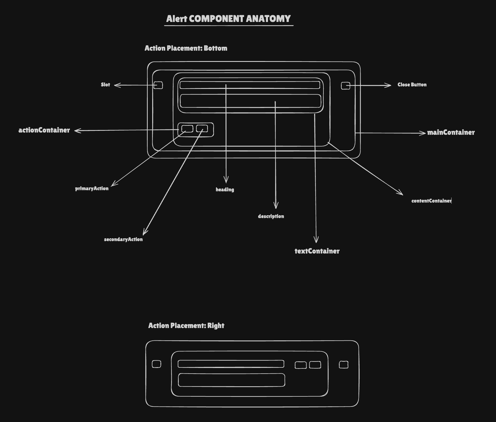

# AlertV2 Component Documentation

## Requirements

Create a scalable Alert component that can display:

- **Heading**: Optional primary text content
- **Description**: Optional secondary text content
- **Slot**: Optional icon or ReactElement slot with configurable dimensions
- **Actions**: Optional primary and secondary action buttons with configurable positioning (bottom or right)
- **Close Button**: Optional dismissible close button with custom onClick handler
- **Multiple Types**: Support for different semantic types (primary, success, warning, error, purple, orange, neutral)
- **Sub Types**: Support for different visual styles (subtle, noFill)
- **Responsive Design**: Support for different breakpoints (sm, lg)
- **Accessibility**: Full ARIA support with proper roles and live regions
- **Theme Support**: Light and dark mode token support

## Anatomy

```
┌─────────────────────────────────────────────────────────────┐
│  [Slot]  [Heading]                    [Actions]  [Separator] │
│          [Description]                          [CloseButton] │
└─────────────────────────────────────────────────────────────┘
```



- **Container**: Main flex container with configurable width, border, background, and padding
- **Slot**: Optional icon/ReactElement container with fixed dimensions
- **Main Container**: Flex container wrapping slot and content
- **Content Container**: Flex container for text and actions with configurable direction (row/column)
- **Text Container**: Vertical flex container for heading and description
- **Heading**: Optional h3 semantic heading with type-based color
- **Description**: Optional paragraph description with type-based color
- **Actions Container**: Horizontal flex container for primary and secondary actions
- **Separator**: Optional vertical separator between actions and close button (shown when actions are on right)
- **Close Button**: Optional dismissible button with X icon

## Props & Types

```typescript
enum AlertV2Type {
    PRIMARY = 'primary',
    SUCCESS = 'success',
    WARNING = 'warning',
    ERROR = 'error',
    PURPLE = 'purple',
    ORANGE = 'orange',
    NEUTRAL = 'neutral',
}

enum AlertV2SubType {
    SUBTLE = 'subtle',
    NO_FILL = 'noFill',
}

enum AlertV2ActionPosition {
    BOTTOM = 'bottom',
    RIGHT = 'right',
}

type AlertV2Action = {
    text: string
    onClick: (event: React.MouseEvent<HTMLButtonElement>) => void
}

type AlertV2Actions = {
    position?: AlertV2ActionPosition
    primaryAction?: AlertV2Action
    secondaryAction?: AlertV2Action
}

type AlertV2Dimensions = {
    width?: CSSObject['width']
    maxWidth?: CSSObject['maxWidth']
    minWidth?: CSSObject['minWidth']
}

type AlertV2Props = {
    type?: AlertV2Type
    subType?: AlertV2SubType
    slot?: {
        slot: ReactElement
        maxHeight?: CSSObject['maxHeight']
    }
    heading?: string
    description?: string
    actions?: AlertV2Actions
    closeButton?: {
        show?: boolean
        onClick?: (event: React.MouseEvent<HTMLButtonElement>) => void
    }
} & Omit<React.HTMLAttributes<HTMLDivElement>, 'slot' | 'className' | 'style'> &
    AlertV2Dimensions
```

## Final Token Type

```typescript
type AlertV2TokensType = {
    width: CSSObject['width']
    maxWidth: CSSObject['maxWidth']
    minWidth: CSSObject['minWidth']
    border: {
        [key in AlertV2Type]: {
            [key in AlertV2SubType]: CSSObject['color']
        }
    }
    borderRadius: CSSObject['borderRadius']
    backgroundColor: {
        [key in AlertV2Type]: {
            [key in AlertV2SubType]: CSSObject['color']
        }
    }
    padding: {
        [key in AlertV2PaddingDirection]: CSSObject['padding']
    }
    gap: { [key in AlertV2ActionPosition]: CSSObject['gap'] }
    slot: {
        maxHeight: CSSObject['maxHeight']
    }
    mainContainer: {
        gap: CSSObject['gap']
        content: {
            gap: { [key in AlertV2ActionPosition]: CSSObject['gap'] }
            textContainer: {
                gap: CSSObject['gap']
                heading: {
                    color: { [key in AlertV2Type]: CSSObject['color'] }
                    fontWeight: CSSObject['fontWeight']
                    fontSize: CSSObject['fontSize']
                    lineHeight: CSSObject['lineHeight']
                }
                description: {
                    color: { [key in AlertV2Type]: CSSObject['color'] }
                    fontWeight: CSSObject['fontWeight']
                    fontSize: CSSObject['fontSize']
                    lineHeight: CSSObject['lineHeight']
                }
            }
            actionContainer: {
                gap: CSSObject['gap']
                primaryAction: {
                    color: { [key in AlertV2Type]: CSSObject['color'] }
                    fontWeight: CSSObject['fontWeight']
                    fontSize: CSSObject['fontSize']
                    lineHeight: CSSObject['lineHeight']
                }
                secondaryAction: {
                    color: { [key in AlertV2Type]: CSSObject['color'] }
                    fontWeight: CSSObject['fontWeight']
                    fontSize: CSSObject['fontSize']
                    lineHeight: CSSObject['lineHeight']
                }
            }
        }
        closeButton: {
            color: { [key in AlertV2Type]: CSSObject['color'] }
            height: CSSObject['height']
            width: CSSObject['width']
        }
    }
}

type ResponsiveAlertV2Tokens = {
    [key in keyof BreakpointType]: AlertV2TokensType
}
```

**Token Pattern**: `component.[target].CSSProp.[size].[variant/type].[subVariant/subType].[state].value`

## Design Decisions

### 1. Component Composition with Sub-Components

**Decision**: Extract rendering logic into separate sub-components (`SlotContainer`, `ActionButton`, `ActionsContainer`, `TextContainer`, `CloseButton`).

**Rationale**: Improves code organization, maintainability, and testability. Each sub-component has a single responsibility, making the code easier to understand and modify. This also enables better code reuse and separation of concerns.

```tsx
const SlotContainer = ({ slot, alertV2Tokens }) => { ... }
const ActionButton = ({ action, type, alertV2Tokens, variant }) => { ... }
const ActionsContainer = ({ actions, type, alertV2Tokens }) => { ... }
const TextContainer = ({ heading, description, type, alertV2Tokens, headingId, descriptionId }) => { ... }
const CloseButton = ({ closeButton, type, alertV2Tokens, actionPlacementBottom }) => { ... }
```

### 2. Comprehensive Accessibility Support

**Decision**: Implement full ARIA attributes including `role="alert"`, `aria-live="assertive"`, `aria-atomic="true"`, and dynamic ID generation for heading/description association.

**Rationale**: Ensures proper screen reader support and WCAG compliance. The `aria-live="assertive"` ensures that alert content is immediately announced to assistive technologies, which is critical for alert components that convey important information.

```tsx
<Block
    role={'alert'}
    aria-live="assertive"
    aria-atomic="true"
    aria-labelledby={headingId}
    aria-describedby={descriptionId}
>
```

### 3. Dynamic ID Generation for Accessibility

**Decision**: Use React's `useId()` hook to generate unique IDs for heading and description elements.

**Rationale**: Ensures proper ARIA relationships between the alert container and its content. The generated IDs are used in `aria-labelledby` and `aria-describedby` to create semantic connections for screen readers.

```tsx
const baseId = useId()
const headingId = heading ? `${baseId}-heading` : undefined
const descriptionId = description ? `${baseId}-description` : undefined
```

### 4. Conditional Layout Based on Action Position

**Decision**: Dynamically adjust flex direction and alignment based on action position (bottom vs right).

**Rationale**: Provides flexible layout options while maintaining consistent spacing and alignment. When actions are positioned at the bottom, the content container uses column direction; when on the right, it uses row direction with proper alignment.

```tsx
flexDirection={actionPlacementBottom ? 'column' : 'row'}
justifyContent={actionPlacementBottom ? 'space-between' : 'flex-start'}
alignItems={actionPlacementBottom ? 'flex-start' : 'center'}
```

### 5. Conditional Separator Rendering

**Decision**: Show a vertical separator between actions and close button only when actions are positioned on the right and close button is visible.

**Rationale**: Provides visual separation between action buttons and close button when they're positioned horizontally, improving visual hierarchy and preventing accidental clicks.

```tsx
const showSeparator =
    actionsPosition === AlertV2ActionPosition.RIGHT && closeButton.show

{
    showSeparator && (
        <Seperator
            width="1px"
            height={addPxToValue(FOUNDATION_THEME.unit[16])}
        />
    )
}
```

### 6. Focus-Visible Styles for Interactive Elements

**Decision**: Use custom `_focusVisible` styles for action buttons and close button to provide clear keyboard navigation feedback.

**Rationale**: Ensures keyboard users have clear visual feedback when navigating through interactive elements. The focus styles use the same color as the action/close button for consistency.

```tsx
_focusVisible={{
    outline: `2px solid ${color}`,
    outlineOffset: '2px',
    borderRadius: '4px',
}}
```

### 7. Responsive Token System

**Decision**: Use `useResponsiveTokens` hook to fetch breakpoint-specific tokens.

**Rationale**: Enables responsive design by allowing different token values for different screen sizes (sm, lg). This provides flexibility in spacing, typography, and layout adjustments across breakpoints.

```tsx
const alertV2Tokens = useResponsiveTokens<AlertV2TokensType>('ALERTV2')
```

### 8. Default Close Button Behavior

**Decision**: Provide default close button configuration with `show: true` and empty onClick handler.

**Rationale**: Makes the close button opt-out rather than opt-in, which is the more common use case. Users can easily disable it by setting `show: false` or override the onClick handler.

```tsx
closeButton = {
    show: true,
    onClick: () => {},
}
```

### 9. Slot Container with ARIA Hidden

**Decision**: Mark the slot container with `aria-hidden="true"` to prevent screen readers from announcing decorative icons.

**Rationale**: Icons in alerts are typically decorative and the alert's semantic meaning is conveyed through text content. Hiding them from assistive technologies prevents redundant announcements.

```tsx
<Block data-element="icon" aria-hidden="true">
    {slot}
</Block>
```

### 10. Filter Blocked Props Utility

**Decision**: Use `filterBlockedProps` utility to prevent certain HTML attributes from being passed to the component.

**Rationale**: Prevents conflicts between component-specific props and native HTML attributes. Ensures that only valid and safe props are spread onto the underlying DOM element.

```tsx
const filteredProps = filterBlockedProps(rest)
{...filteredProps}
```

### 11. Forward Ref Support

**Decision**: Use `forwardRef` to allow parent components to access the underlying DOM element.

**Rationale**: Enables imperative DOM operations when needed (e.g., scrolling, focus management, measuring dimensions) while maintaining the declarative React pattern.

```tsx
const AlertV2 = forwardRef<HTMLDivElement, AlertV2Props>((props, ref) => {
    return <Block ref={ref} ... />
})
```

### 12. Semantic HTML Elements

**Decision**: Use semantic HTML elements (`h3` for heading, `p` for description) within the Text component.

**Rationale**: Improves SEO, accessibility, and semantic meaning. Screen readers can better understand the content hierarchy, and search engines can better index the content.

```tsx
<Text as="h3" ...>{heading}</Text>
<Text as="p" ...>{description}</Text>
```
