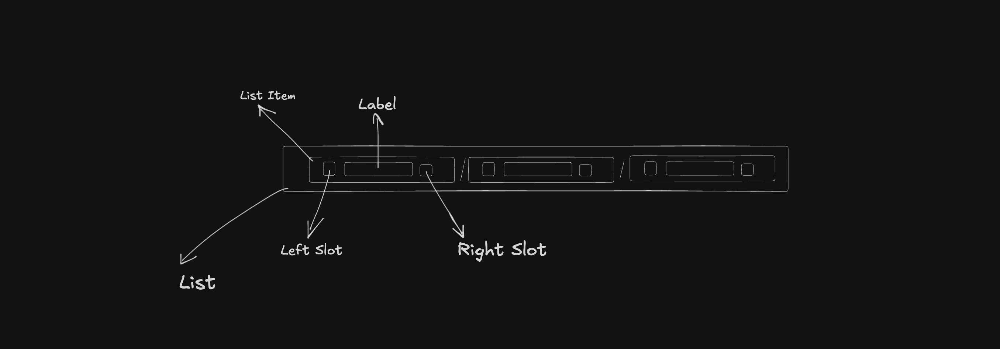

# BreadcrumbV2 Component Documentation

## Requirements

- Display a linear list of navigational links (breadcrumbs) showing the current path.
- Support optional left/right slot icons for each breadcrumb item.
- Overflow handling: when item count exceeds a threshold show a menu/ellipsis to collapse middle items.
- Skeleton state for loading.
- Fully accessible: nav landmark with an accessible name, programmatically determinable current page via `aria-current="page"`.
- Responsive layout and horizontal scrolling when necessary.

## Anatomy

```
Home / … / Category / Subcategory / Current Page
```

- Container: nav landmark containing an ordered list of breadcrumb items.
- Breadcrumb item: link or button with optional leading/trailing icons.
- Overflow button: ellipsis control that exposes hidden items (aria-haspopup / aria-expanded).
- Separator: visual divider (e.g., "/") between items.



## Props & Types

```typescript
export type BreadcrumbV2ItemType = {
    leftSlot?: React.ReactNode
    rightSlot?: React.ReactNode
    label: string
    href: string
    onClick?: (event: React.MouseEvent<HTMLAnchorElement>) => void
    skeleton?: { show: boolean; variant: SkeletonVariant }
}

type BreadcrumbV2Props = {
    items: BreadcrumbV2ItemType[]
    skeleton?: { show: boolean; variant: SkeletonVariant }
}
```

Usage:

```tsx
<Breadcrumb
    items={[
        { label: 'Home', href: '/' },
        { label: 'Products', href: '/products' },
        { label: 'Electronics', href: '/products/electronics' },
        { label: 'Cameras', href: '/products/electronics/cameras' },
    ]}
/>
```

## Tokens (example shape)

```typescript
export type BreadcrumbV2TokensType = {
    gap: CSSObject['gap']
    item: {
        padding: CSSObject['padding']
        gap: CSSObject['gap']
        text: {
            fontSize: CSSObject['fontSize']
            fontWeight: CSSObject['fontWeight']
            color: { default: string; active: string }
        }
    }
}
```

## Design Decisions

### 1. Overflow collapsing for long trails

Decision: Collapse middle items into an overflow menu once items exceed MAX_ITEMS (default 4).

Rationale: Prevents excessively long breadcrumb trails from breaking layout while keeping the first and last items visible for context.

### 2. Use nav landmark with accessible name

Decision: Wrap breadcrumbs in a `<nav aria-label="Breadcrumb navigation">` and use an ordered list for semantic order.

Rationale: Improves discoverability for screen readers and provides programmatic context.

### 3. Mark the current page with aria-current

Decision: The active breadcrumb (last item when not collapsed) gets `aria-current="page"` and is not focusable as a link.

Rationale: Conveys the current location to assistive technologies and avoids redundant navigation.

### 4. Slots and non-text content

Decision: Support optional `leftSlot` and `rightSlot` per item for decorative icons; mark them `aria-hidden="true"` when decorative.

Rationale: Allows richer visual representation without harming accessibility.

### 5. Skeleton support

Decision: Provide a skeleton variant that mirrors the breadcrumb shape while loading.

Rationale: Improves perceived performance and layout stability.

## Accessibility Notes

- The breadcrumb is wrapped in a `nav` element with `aria-label="Breadcrumb navigation"`.
- Each item is a link (`<a>`) except the current page which is indicated with `aria-current="page"`.
- Overflow control uses `aria-haspopup="menu"` and an accessible label like `Show N more breadcrumb items`.
- Ensure keyboard operability for the overflow menu and visible focus styles.
