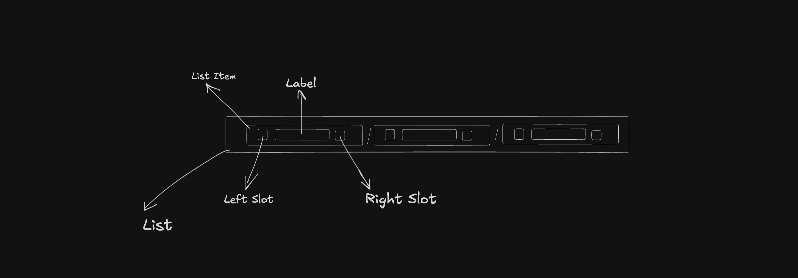

# BreadcrumbV2 Component Documentation

## Requirements

- Display a linear list of navigational links (breadcrumbs) showing the current path.
- **Composable API**: `Item`, `Page`, optional `Icon` (repeat for multiple icons; **order** defines layout), and `Separator` (used between items by the root; overridable via compound export).
- **Overflow**: when the number of `Item` children exceeds **`maxItems`** (default `4`), show first crumb, an ellipsis control, then the **last three** segments.
- Fully accessible: `nav` landmark with an accessible name, current page via `aria-current="page"` on the active item.
- Responsive layout and horizontal scrolling on the nav container when necessary.
- **Loading**: no built-in skeleton on `BreadcrumbV2`; compose the shared **`Skeleton`** (or placeholders) beside real items in the app if needed.

## Anatomy

```
Home / … / Category / Subcategory / Current Page
```

- **Root (`BreadcrumbV2`)**: `nav` + `ol`, filters direct **`Item`** children only; injects separators between items; renders overflow ellipsis when needed.
- **Item (`BreadcrumbV2.Item`)**: wraps content in a link (or current-page text semantics via tokens); accepts **`Page`**, **`Icon`**, and arbitrary composition order.
- **Page (`BreadcrumbV2.Page`)**: label text styling from tokens.
- **Icon (`BreadcrumbV2.Icon`)**: decorative icon wrapper (`aria-hidden`, `data-element="breadcrumb-icon"`). Use multiple `Icon` instances before/after `Page` as needed (e.g. home glyph + chevron).
- **Overflow**: ellipsis `button` with `aria-label` like `Show N more breadcrumb items`, `aria-haspopup="menu"`, `aria-expanded="false"` (menu wiring is app responsibility).
- **Separator**: `/` (or custom) between items via **`BreadcrumbV2Separator`** inside the root implementation.



## Root props & compound exports

```typescript
export type BreadcrumbV2Props = {
    children?: React.ReactNode
    /** When `Item` count exceeds this, show ellipsis + last three segments. Default `4`. */
    maxItems?: number
}

// Attached to default export:
// BreadcrumbV2.Item, .Page, .Icon, .Separator
```

If there are **no** `Item` children, the root renders **nothing** (`null`).

### Composable usage

```tsx
<BreadcrumbV2 maxItems={4}>
    <BreadcrumbV2.Item href="/">
        <BreadcrumbV2.Icon>
            <Home size={16} />
        </BreadcrumbV2.Icon>
        <BreadcrumbV2.Page>Home</BreadcrumbV2.Page>
        <BreadcrumbV2.Icon>
            <ChevronRight size={14} />
        </BreadcrumbV2.Icon>
    </BreadcrumbV2.Item>
    <BreadcrumbV2.Item href="/docs">
        <BreadcrumbV2.Page>Docs</BreadcrumbV2.Page>
    </BreadcrumbV2.Item>
    <BreadcrumbV2.Item isActive>
        <BreadcrumbV2.Page>Components</BreadcrumbV2.Page>
    </BreadcrumbV2.Item>
</BreadcrumbV2>
```

- **`isActive`**: optional per `Item`; if omitted, the **last** `Item` is treated as current.
- **`onClick`** on `Item`: optional; `preventDefault` is applied when provided for SPA routing.

### Optional data-helper type (demos / mapping)

For app code that keeps an array of segments, you can map rows to `Item`/`Page`/`Icon` yourself. A shared **type** (no runtime API) documents that shape:

```typescript
export type BreadcrumbV2ItemType = {
    leftSlot?: React.ReactNode
    rightSlot?: React.ReactNode
    label: string
    href: string
    onClick?: (event: React.MouseEvent<HTMLAnchorElement>) => void
}
```

Map `leftSlot` / `rightSlot` to `<BreadcrumbV2.Icon>{…}</BreadcrumbV2.Icon>` before/after `<BreadcrumbV2.Page>{label}</BreadcrumbV2.Page>`.

## Tokens

```typescript
export type BreadcrumbV2State = 'default' | 'hover' | 'active'

export type BreadcrumbV2TokensType = {
    gap: CSSObject['gap']
    item: {
        padding: CSSObject['padding']
        gap: CSSObject['gap']
        text: {
            fontSize: CSSObject['fontSize']
            fontWeight: CSSObject['fontWeight']
            color: {
                [key in BreadcrumbV2State]: CSSObject['color']
            }
        }
    }
    ellipsis: {
        color: CSSObject['color']
        borderRadius: CSSObject['borderRadius']
        size: number
    }
    separator: {
        color: CSSObject['color']
    }
}

export type ResponsiveBreadcrumbV2Tokens = {
    [key in keyof BreakpointType]: BreadcrumbV2TokensType
}
```

Registered as **`BREADCRUMBV2`** in theme / `useResponsiveTokens`.

## Design Decisions

### 1. Composable-only surface

**Decision**: `BreadcrumbV2` accepts **`Item` children** only; no `items[]` prop on the component.

**Rationale**: Clear slotting for icons and labels, flexible order, and alignment with other compound components in the design system.

### 2. Single `Icon` subcomponent

**Decision**: Replaced separate “start” / “end” icon components with **`BreadcrumbV2.Icon`**; layout is defined by child order next to `Page`.

**Rationale**: Icons are decorative variants of the same concern; naming matches composition rather than assumed position.

### 3. Overflow collapsing

**Decision**: When `Item` count **>** `maxItems` (default `4`), render first item, ellipsis, then the **last three** items. Middle items are not rendered in the bar (ellipsis is a button; hook up a menu in the product).

**Rationale**: Preserves context (root + recent path) without breaking narrow layouts.

### 4. Nav + ordered list

**Decision**: Root uses `<nav aria-label="Breadcrumb navigation">` and an **`ol`** for ordered segments.

**Rationale**: Landmark + list semantics for assistive tech.

### 5. Current page

**Decision**: Active segment uses `aria-current="page"` and omits `href` behavior from tokens/styling on the active `Item`.

**Rationale**: Standard pattern for “you are here” in a trail.

### 6. No root skeleton

**Decision**: Removed dedicated `BreadcrumbV2Skeleton`; loading states use app-level **`Skeleton`** or conditional `Item` content.

**Rationale**: BreadcrumbV2 stays presentational; loading UX varies by product (number of crumbs, widths, etc.).

## Accessibility Notes

- Root: `nav` with `aria-label="Breadcrumb navigation"`.
- Each non-active crumb is navigable as a link; active crumb exposes `aria-current="page"`.
- `BreadcrumbV2.Icon` sets `aria-hidden="true"` on the wrapper when icons are decorative.
- Ellipsis: `aria-label` includes the count of hidden items; add keyboard and menu behavior when implementing the overflow panel.
- Ensure focus styles on links and the ellipsis control meet WCAG contrast for the active theme.

## Related

- Implementation: `packages/blend/lib/components/BreadcrumbV2/`
- Storybook: `apps/storybook/stories/components/BreadCrumbV2/BreadCrumbV2.stories.tsx`
- Site demo: `apps/site/src/demos/BreadcrumbV2Demo.tsx`
