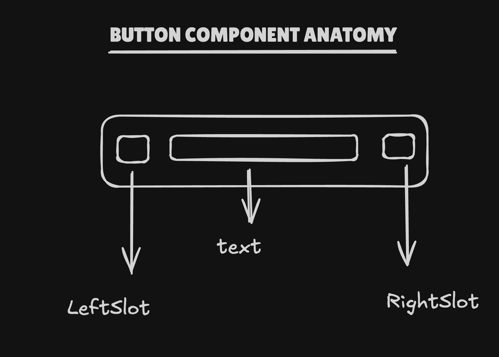

# ButtonV2 Component Documentation

## Requirements

Create a scalable Button component that can:

- **Support variants**: `primary`, `secondary`, `danger`, `success`
- **Support sizes**: `sm`, `md`, `lg`
- **Support subtypes**: `default`, `iconOnly`, `inline`
- **Handle content**: optional text, left/right icon slots
- **Handle states**: default, hover, active, disabled, loading
- **Support groups**: visually connect buttons in a group (left/center/right)
- **Provide skeleton**: loading skeleton wrapper without layout shift
- **Be accessible**: keyboard operable, screen-reader friendly, ARIA-aware

## Anatomy



```
┌───────────────────────────────────────────────┐
│ [Left Icon]   Text Label   [Right Icon]      │
└───────────────────────────────────────────────┘
```

- **Container**: `PrimitiveButton` with tokens for background, border, radius, shadow, outline
- **Left Slot**: optional icon/content before text
- **Text**: main label, token-driven typography
- **Right Slot**: optional icon/content after text
- **Loader**: centered spinner when `loading` is true
- **Skeleton Wrapper**: `Skeleton` around the button when `skeleton.showSkeleton` is true

## Props & Types

```typescript
export enum ButtonV2Type {
    PRIMARY = 'primary',
    SECONDARY = 'secondary',
    DANGER = 'danger',
    SUCCESS = 'success',
}

export enum ButtonV2Size {
    SMALL = 'sm',
    MEDIUM = 'md',
    LARGE = 'lg',
}

export enum ButtonV2SubType {
    DEFAULT = 'default',
    ICON_ONLY = 'iconOnly',
    INLINE = 'inline',
}

export enum ButtonV2State {
    DEFAULT = 'default',
    HOVER = 'hover',
    ACTIVE = 'active',
    DISABLED = 'disabled',
}

export type ButtonSlot = {
    slot: React.ReactNode
    maxHeight?: string | number
}

export type ButtonSkeleton = {
    showSkeleton?: boolean
    skeletonVariant?: SkeletonVariant
}

export type ButtonBaseProps = {
    buttonType?: ButtonV2Type
    size?: ButtonV2Size
    subType?: ButtonV2SubType
    text?: string
    leftSlot?: ButtonSlot
    rightSlot?: ButtonSlot
    loading?: boolean
    skeleton?: ButtonSkeleton
    buttonGroupPosition?: 'center' | 'left' | 'right'
    width?: string | number
    minWidth?: string | number
    maxWidth?: string | number
    state?: ButtonV2State
}

export type ButtonV2Props = ButtonBaseProps &
    Omit<React.ButtonHTMLAttributes<HTMLButtonElement>, 'style' | 'className'>
```

_Note_: `LinkButtonProps` extend the same base props for anchor-based buttons and are documented in code.

## Final Token Type

```typescript
export type ButtonV2TokensType = Readonly<{
    gap: CSSObject['gap']
    backgroundColor: {
        [type in ButtonV2Type]: {
            [subType in ButtonV2SubType]: {
                [state in ButtonV2State]: CSSObject['background']
            }
        }
    }
    borderRadius: {
        [size in ButtonV2Size]: {
            [type in ButtonV2Type]: {
                [subType in ButtonV2SubType]: CSSObject['borderRadius']
            }
        }
    }
    padding: {
        [direction in PaddingDirection]: {
            [size in ButtonV2Size]: {
                [type in ButtonV2Type]: {
                    [subType in ButtonV2SubType]: CSSObject['padding']
                }
            }
        }
    }
    border: {
        [type in ButtonV2Type]: {
            [subType in ButtonV2SubType]: {
                [state in ButtonV2State]: CSSObject['border']
            }
        }
    }
    shadow: {
        [type in ButtonV2Type]: {
            [subType in ButtonV2SubType]: {
                [state in ButtonV2State]: CSSObject['boxShadow']
            }
        }
    }
    outline: {
        [type in ButtonV2Type]: {
            [subType in ButtonV2SubType]: {
                [state in ButtonV2State]: CSSObject['outline']
            }
        }
    }
    text: {
        color: {
            [type in ButtonV2Type]: {
                [subType in ButtonV2SubType]: {
                    [state in ButtonV2State]: CSSObject['color']
                }
            }
        }
        fontSize: {
            [size in ButtonV2Size]: CSSObject['fontSize']
        }
        fontWeight: {
            [size in ButtonV2Size]: CSSObject['fontWeight']
        }
        lineHeight: {
            [size in ButtonV2Size]: CSSObject['lineHeight']
        }
    }
}>
```

**Token Pattern**: `component.[target].CSSProp.[size].[type].[subType].[state].value`

## Design Decisions

### 1. Centralized Content Rendering

**Decision**: Use a dedicated `renderButtonContent` helper to render loader, text, and slots.

**Rationale**: Keeps the main component small and declarative while encapsulating icon sizing, colors, and loading behavior in one place.

```tsx
{
    renderButtonContent({
        isLoading,
        isSkeleton,
        disabled,
        state,
        buttonType,
        subType,
        size,
        text,
        leftSlot,
        rightSlot,
        tokens: buttonTokens,
    })
}
```

### 2. Explicit Loading State with Accessible Feedback

**Decision**: When `loading` is true, render a `LoaderCircle` icon and visually hidden text instead of the usual content.

**Rationale**: Provides clear visual and screen-reader feedback while preventing accidental double-submits.

```tsx
if (isLoading) {
    return (
        <>
            <LoaderCircle
                size={loaderSize}
                color={tokens.text.color[buttonType][subType].default}
                data-status="loading"
                aria-hidden="true"
            />
            <VisuallyHidden aria-live="polite">
                Loading, please wait
            </VisuallyHidden>
        </>
    )
}
```

### 3. Token-Driven Layout and Style

**Decision**: Derive padding, radius, background, border, shadow, and text styles from `ButtonV2TokensType` via utility functions.

**Rationale**: Ensures a single source of truth for visual styling across themes and breakpoints, and makes new variants easy to add.

```tsx
const paddingTokens = getButtonPadding(size, buttonType, subType, buttonTokens)
const buttonStyles = getButtonStyles(
    isSkeleton,
    isDisabled,
    buttonType,
    subType,
    buttonTokens,
    buttonGroupPosition
)
```

### 4. Group-Aware Border Radius

**Decision**: Compute border radius with `getBorderRadius` / `getSkeletonBorderRadius` using `buttonGroupPosition`.

**Rationale**: Allows buttons in a group to visually connect (shared edges) while keeping the system token-driven.

```tsx
const borderRadius = getBorderRadius(
    size,
    buttonType,
    subType,
    buttonGroupPosition,
    buttonTokens
)
```

### 5. Skeleton as a Non-Interactive Wrapper

**Decision**: Wrap the real button in a `Skeleton` when `skeleton.showSkeleton` is true and treat the button as disabled.

**Rationale**: Preserves exact layout and content structure while clearly indicating a loading layout state and blocking interactions.

```tsx
if (isSkeleton) {
    const skeletonRadius = getSkeletonBorderRadius(
        size,
        buttonType,
        subType,
        buttonGroupPosition,
        buttonTokens
    )
    const skeletonWidth = getSkeletonWidth(width)

    return (
        <Skeleton
            variant={skeletonVariant}
            loading
            padding="0"
            borderRadius={skeletonRadius}
            width={skeletonWidth}
        >
            {buttonElement}
        </Skeleton>
    )
}
```

### 6. Accessibility-First API

**Decision**: Use `getButtonAriaAttributes` and `createButtonKeyboardHandler` to handle ARIA attributes and keyboard interactions.

**Rationale**: Centralizes accessibility concerns, ensures consistent disabled/loading semantics, and keeps the component implementation clean.

```tsx
const ariaAttrs = getButtonAriaAttributes({
    disabled: isDisabled,
    loading: isLoading,
    ariaLabel,
})

const keyboardHandler = createButtonKeyboardHandler(() => {
    if (!isDisabled && !isLoading && onClick) {
        onClick(syntheticEvent)
    }
}, isDisabled)
```
