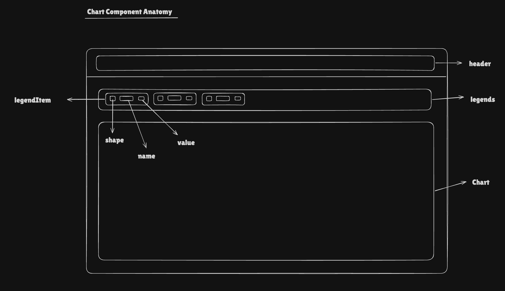

# ChartV2 Component Documentation

## Requirements

Design a Highcharts-based chart component that:

- **Supports multiple chart types** via `Highcharts.Options` (line, column, bar, area, scatter, pie, sankey, etc.).
- **Integrates with Blend tokens** so borders, background, axes and legends follow the design system (light/dark, responsive).
- **Provides layout primitives**:
    - `ChartContainerV2` for the framed card container.
    - `ChartHeaderV2` for titles/filters/actions.
    - `ChartV2Legend` for shared/custom legends.
    - `ChartV2Fullscreen` for fullscreen experience.
- **Handles states**:
    - Normal (data present).
    - Skeleton loading.
    - No-data with optional CTA.
- **Is accessible**:
    - Exposes chart semantics and statuses.
    - Legends are keyboard/toggle friendly.
    - No-data/skeleton states are announced to assistive tech.
- **Is Highcharts-agnostic at call sites**:
    - Consumers pass `options: Highcharts.Options`.
    - Component wires tokens and blocked props internally.

## Anatomy

```
┌───────────────────────────────────────────────┐
│ ChartContainerV2 (card)                      │
│ ┌ ChartHeaderV2 (optional)                 ┐ │
│ │  [Title / Controls / Slots]              │ │
│ └──────────────────────────────────────────┘ │
│ [Optional external ChartV2Legend]            │
│ ┌ HighchartsReact (via ChartV2)            ┐ │
│ │  Plot area, axes, series                 │ │
│ └──────────────────────────────────────────┘ │
│ [ChartV2Skeleton or ChartV2NoData states]    │
└───────────────────────────────────────────────┘
```



- **ChartContainerV2**: Section-like wrapper with border, radius, background, shadow.
- **ChartHeaderV2**: Padded header row for titles and actions.
- **ChartV2Legend**: Token-driven legend rendered outside Highcharts for better control and shared legends.
- **ChartV2**: Highcharts adapter that:
    - Hides credits.
    - Applies design tokens via `mergeChartOptions`.
    - Handles skeleton/no-data states.

## Props & Types

### Core `ChartV2` props

```typescript
export type ChartV2SkeletonProps = {
    show: boolean
    variant?: SkeletonVariant
    height?: number
}

export type ChartV2NoDataProps = {
    title?: string
    subtitle?: string
    slot?: ReactNode
    button?: ButtonProps
}

export type ChartV2Props = Omit<HighchartsReactProps, 'className' | 'style'> & {
    highcharts?: ChartV2Type // override Highcharts instance if needed
    skeleton?: ChartV2SkeletonProps // loading state
    noData?: ChartV2NoDataProps // empty state
}

export type ChartV2Options = Highcharts.Options
export type ChartV2SeriesOptionsType = Highcharts.SeriesOptionsType
```

### Layout primitives

```typescript
export interface ChartV2ContainerProps {
    children: ReactNode
}

export interface ChartV2HeaderProps {
    children: ReactNode
}

export type ChartV2LegendItem = Highcharts.Series | Highcharts.Point

export interface ChartV2CustomLegendItem {
    key: string
    name: string
    color?: string
    value?: string | number
}

export interface ChartV2LegendProps {
    chartRef?: RefObject<ChartV2ReactRefObject | null> // single chart
    chartRefs?: ReadonlyArray<RefObject<ChartV2ReactRefObject | null>> // shared legend
    customLegendItems?: ChartV2CustomLegendItem[]
    renderItem?: (params: {
        item: ChartV2LegendItem
        name: string
        visible: boolean
        color: string
        value?: string | number
        onClick: () => void
    }) => ReactNode
    layout?: 'horizontal' | 'vertical'
}
```

## Final Token Type

```typescript
type ChartV2TokensType = {
    border: CSSObject['border']
    borderRadius: CSSObject['borderRadius']
    boxShadow: CSSObject['boxShadow']
    backgroundColor: CSSObject['backgroundColor']

    header: {
        padding: {
            top: CSSObject['padding']
            right: CSSObject['padding']
            bottom: CSSObject['padding']
            left: CSSObject['padding']
        }
        backgroundColor: CSSObject['backgroundColor']
        borderBottom: CSSObject['borderBottom']
    }

    legends: {
        gap: CSSObject['gap']
        legendItem: {
            gap: CSSObject['gap']
            shape: {
                width: CSSObject['width']
                height: CSSObject['height']
                borderRadius: CSSObject['borderRadius']
            }
            text: {
                gap: CSSObject['gap']
                name: {
                    fontSize: CSSObject['fontSize']
                    fontWeight: CSSObject['fontWeight']
                    lineHeight: CSSObject['lineHeight']
                    color: CSSObject['color']
                }
                value: {
                    fontSize: CSSObject['fontSize']
                    fontWeight: CSSObject['fontWeight']
                    lineHeight: CSSObject['lineHeight']
                    color: CSSObject['color']
                }
                separator: {
                    color: CSSObject['color']
                    width: CSSObject['width']
                    height: CSSObject['height']
                }
            }
        }
    }

    chart: {
        backgroundColor: CSSObject['backgroundColor']
        xAxis: {
            title: {
                fontSize: CSSObject['fontSize']
                color: CSSObject['color']
                fontWeight: CSSObject['fontWeight']
                lineHeight: CSSObject['lineHeight']
            }
            labels: {
                fontSize: CSSObject['fontSize']
                color: CSSObject['color']
                fontWeight: CSSObject['fontWeight']
                lineHeight: CSSObject['lineHeight']
            }
            line: {
                width: CSSObject['width']
                color: CSSObject['color']
            }
            gridLine: {
                width: CSSObject['width']
                color: CSSObject['color']
            }
        }
        yAxis: {
            title: {
                fontSize: CSSObject['fontSize']
                color: CSSObject['color']
                fontWeight: CSSObject['fontWeight']
                lineHeight: CSSObject['lineHeight']
            }
            labels: {
                fontSize: CSSObject['fontSize']
                color: CSSObject['color']
                fontWeight: CSSObject['fontWeight']
                lineHeight: CSSObject['lineHeight']
            }
            line: {
                width: CSSObject['width']
                color: CSSObject['color']
            }
            gridLine: {
                width: CSSObject['width']
                color: CSSObject['color']
            }
        }
    }
}
```

**Token Pattern**:  
`component.chartV2.[header|legends|chart].[target].CSSProp.[state/breakpoint].value`

## Design Decisions

### 1. Highcharts adapter instead of custom chart rendering

**Decision**: `ChartV2` is a thin adapter around `HighchartsReact` that:

- Accepts `Highcharts.Options` directly.
- Applies design-system tokens through `mergeChartOptions`.
- Hides Highcharts credits by default.

**Rationale**: Reuses a battle-tested charting engine while centralizing theming and accessibility concerns in a single place.

---

### 2. External, token-driven legends

**Decision**: Implement `ChartV2Legend` as a separate component that reads from Highcharts instances via refs (`chartRef` / `chartRefs`) and uses tokens for spacing, typography, and shapes.

**Rationale**:

- Consistent styling across chart types.
- Shared legends across multiple charts (dashboard layouts).
- Better control over hover/selection behavior (e.g. syncing multiple charts) than Highcharts’ built-in legend.

---

### 3. Explicit loading and no-data states

**Decision**:

- `skeleton.show` renders `ChartV2Skeleton` with `data-chart="Skeleton"` and `role="status"`.
- When there is no series data and `noData` is provided, render `ChartV2NoData` with `data-chart="No-Data"` and `role="status"`.

**Rationale**:

- Clear UX for transient loading vs. permanent empty states.
- WCAG 4.1.3 compliance by announcing state changes to assistive tech.

---

### 4. Accessibility hooks and data attributes

**Decision**:

- Use `containerProps` on `HighchartsReact` to set `data-chart` based on the first series type (`line`, `column`, etc.).
- In legends:
    - Root: `role="list"`, `aria-label="Chart legend"`.
    - Items: `data-element="chart-legend"`, `data-id={key}`, `role="listitem"`.
    - Swatch/text/value: `data-element="chart-legend-color"`, `data-element="chart-legend-text"`, `data-legend="value"`.

**Rationale**:

- Makes charts and legends easily discoverable for automated testing and analytics.
- Follows ARIA Authoring Practices for lists and status messages while keeping the main chart surface delegated to Highcharts.

---

### 5. Blocked props and safe defaults

**Decision**:

- Reuse `filterBlockedProps` to strip `className` and `style` from the props passed to `HighchartsReact`.
- Provide a safe default `noData` configuration and hide Highcharts credits by default.

**Rationale**:

- Prevents consumers from accidentally breaking layout via inline styles or class overrides on the underlying chart container.
- Ensures all charts render with a consistent baseline UX even when consumers provide minimal configuration.
