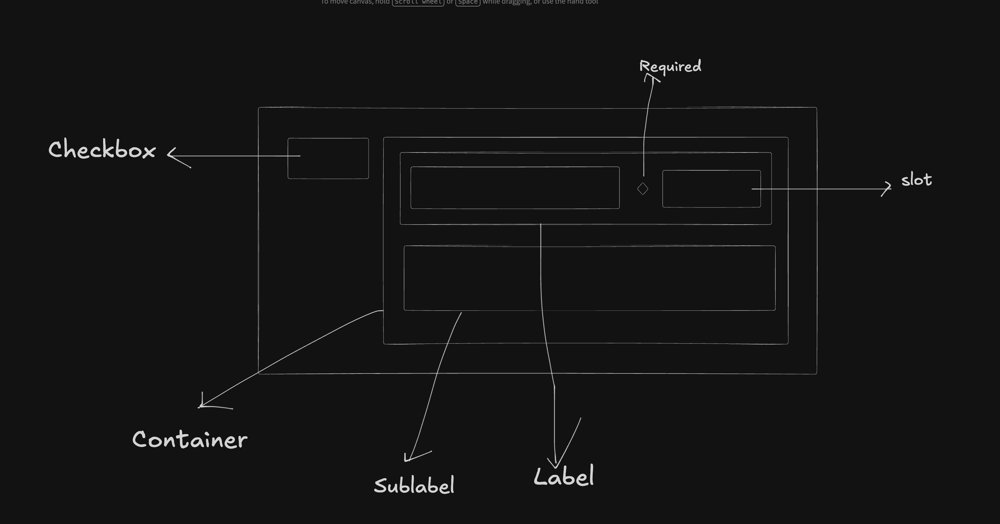

# CheckboxV2 Component Documentation

## Requirements

Create a scalable Checkbox component that can display:

- **Checked / Unchecked / Indeterminate**: Support for three visual states with smooth animations
- **Label & SubLabel**: Primary label with optional sub-label text
- **Text Truncation**: Configurable max length for label and sub-label with tooltip support
- **Icon Slot**: Optional icon slot next to the label
- **Sizes**: Small (sm) and Medium (md)
- **States**: Default, hover, disabled, error, focus
- **Accessibility**: Full ARIA support with proper roles, labels, and descriptions
- **Theme Support**: Light and dark theme tokens
- **Required Indicator**: Visual asterisk for required fields
- **Keyboard Interactions**: Space to toggle, arrow/tab navigation support

## Anatomy

```
┌─────────────────────────────────────────────────────────────┐
│  ┌─────────────┐  ┌─────────────────────────────────────┐   │
│  │   [Check]   │  │  Label Text [Icon]                   │  │
│  │    [Box]    │  │  Sub Label Text                      │  │
│  └─────────────┘  └─────────────────────────────────────┘   │
└─────────────────────────────────────────────────────────────┘
```



- **Container**: Flex container with gap between box and content
- **Checkbox Box**: Square clickable element with border and background based on state
- **Checkmark**: Visible when checked; animated for appearance/disappearance
- **Label**: Primary text label with optional required asterisk
- **Icon Slot**: Optional ReactElement icon displayed next to label
- **SubLabel**: Secondary descriptive text below the label

## Props & Types

```typescript
export type SelectorV2Size = 'sm' | 'md'

export type CheckboxV2Props = {
    checked?: boolean
    defaultChecked?: boolean
    indeterminate?: boolean
    onChange?: (checked: boolean) => void
    required?: boolean
    error?: boolean
    disabled?: boolean
    label?: string
    subLabel?: string
    name?: string
    value?: string
    size?: SelectorV2Size
    slot?: {
        slot: ReactElement
        maxHeight?: CSSObject['maxHeight']
    }
    maxLength?: {
        label?: number
        subLabel?: number
    }
} & Omit<
    InputHTMLAttributes<HTMLInputElement>,
    'className' | 'style' | 'onChange'
>
```

## Final Token Type

```
export type CheckboxV2TokensType = {
    gap: CSSObject['gap']
    checkbox: {
        height: {
            [key in SelectorV2Size]: CSSObject['height']
        }
        width: {
            [key in SelectorV2Size]: CSSObject['width']
        }
        backgroundColor: {
            [key in CheckboxV2CheckedState]?: {
                [key in SelectorV2InteractionState]?: CSSObject['backgroundColor']
            }
        }

        borderRadius: { [key in SelectorV2Size]: CSSObject['borderRadius'] }

        border: {
            [key in CheckboxV2CheckedState]?: {
                [key in SelectorV2InteractionState]?: CSSObject['border']
            }
        }

        outline: CSSObject['outline']
        outlineOffset: CSSObject['outlineOffset']
        boxShadow: CSSObject['boxShadow']
        icon: {
            color: {
                [key in CheckboxV2CheckedState]?: {
                    [key in Extract<
                        SelectorV2InteractionState,
                        'default' | 'disabled'
                    >]?: CSSObject['color']
                }
            }
            width: { [key in SelectorV2Size]: CSSObject['width'] }
            height: { [key in SelectorV2Size]: CSSObject['height'] }
            strokeWidth: { [key in SelectorV2Size]: CSSObject['strokeWidth'] }
        }
    }
    content: {
        gap: CSSObject['gap']
        label: {
            gap: CSSObject['gap']
            color: {
                [key in SelectorV2InteractionState]: CSSObject['color']
            }
            fontSize: { [key in SelectorV2Size]: CSSObject['fontSize'] }
            fontWeight: { [key in SelectorV2Size]: CSSObject['fontWeight'] }
            lineHeight: { [key in SelectorV2Size]: CSSObject['lineHeight'] }
            slot: {
                maxHeight: {
                    [key in SelectorV2Size]: CSSObject['maxHeight']
                }
            }
        }
        subLabel: {
            color: {
                [key in SelectorV2InteractionState]: CSSObject['color']
            }
            fontSize: { [key in SelectorV2Size]: CSSObject['fontSize'] }
            fontWeight: { [key in SelectorV2Size]: CSSObject['fontWeight'] }
            lineHeight: { [key in SelectorV2Size]: CSSObject['lineHeight'] }
        }
        required: {
            color: CSSObject['color']
        }
    }
}
```

**Token Pattern**: `component.[target].CSSProp.[size].[variant/state].value`

## Design Decisions

### 1. Component Separation for Maintainability

**Decision**: Split CheckboxV2 into sub-components: `CheckboxV2Input`, `CheckboxV2Visual`, `CheckboxV2Content`, and the wrapper `CheckboxV2`.

**Rationale**: Improves organization, testability, and reusability. Responsibilities:

- `CheckboxV2Input`: Native input element (visually hidden) to preserve form behavior and native keyboard handling
- `CheckboxV2Visual`: Renders the box and animated check/indeterminate mark
- `CheckboxV2Content`: Manages label, sub-label, and slot rendering
- `CheckboxV2`: Orchestrates state, accessibility, and token wiring

### 2. Reusable Selector Components

**Decision**: Use shared `SelectorsLabel` and `SelectorsSubLabel` components for labels and truncation logic.

**Rationale**: Reuse across Switch, Radio, and Checkbox ensures consistent truncation, tooltip behavior, and accessibility.

```tsx
<SelectorsLabel
    uniqueId={uniqueId}
    disabled={disabled}
    error={error}
    required={required}
    size={size}
    label={label ?? ''}
    tokens={tokens}
    maxLength={labelMaxLength}
/>
```

### 3. Indeterminate State Handling

**Decision**: Expose `indeterminate` prop and render a distinct visual (dash) for this state. Indeterminate does not mean "partially checked" semantically; it represents a third visual state and should be reflected in ARIA via `aria-checked="mixed"`.

**Rationale**: Common in grouped checkboxes (select all / partial selection). Keeps API explicit rather than inferring from checked & children.

### 4. Text Truncation with Tooltip

**Decision**: Implement automatic text truncation with tooltip display when text exceeds `maxLength`.

**Rationale**: Prevents layout breaking with long text while preserving accessibility. Users can see full text via tooltip on hover.

```tsx
const { truncatedValue, fullValue, isTruncated } = getTruncatedText(
    label,
    maxLength
)
return isTruncated ? <Tooltip content={fullValue}>{content}</Tooltip> : content
```

### 5. ARIA Attributes and Accessibility

**Decision**: Provide comprehensive ARIA support using `role="checkbox"` (when not using native input), `aria-checked` (true/false/mixed), `aria-required`, `aria-invalid`, `aria-disabled`, and `aria-describedby` for sub-labels.

**Rationale**: Ensures proper screen reader support and keyboard navigation. Prefer native `input[type="checkbox"]` when possible to leverage built-in semantics.

```tsx
const ariaAttributes = {
    'aria-required': required || undefined,
    'aria-invalid': error || undefined,
    'aria-disabled': disabled || undefined,
    'aria-checked': indeterminate ? 'mixed' : checked,
    'aria-describedby': mergeAriaDescribedBy(subLabelId, customAriaDescribedBy),
}
```

### 6. Keyboard & Focus Interaction

**Decision**: Keep native input focus handling (visually hidden) so space toggles the checkbox, and the component gets sensible focus outlines from tokens. Provide clear focus tokens for high contrast and accessibility.

**Rationale**: Native input preserves expected keyboard behavior across platforms and assistive technologies.

### 7. Animation & Performance

**Decision**: Animate checkmark opacity/scale and box background with GPU-friendly transforms where possible. Avoid layout-triggering animations.

**Rationale**: Smooth interactions without layout jank on low-powered devices.

## Examples

```tsx
<CheckboxV2
    label="Accept terms"
    subLabel="You must accept the terms to continue"
    checked={checked}
    onChange={setChecked}
    required
    size="md"
/>
```

```tsx
<CheckboxV2 label="Select all" indeterminate disabled size="sm" />
```

## Testing Notes

- Test keyboard behavior (space to toggle, focus ring visible)
- Test accessible names using screen readers (NVDA/VoiceOver)
- Test truncation + tooltip across breakpoints
- Test indeterminate semantics in grouped scenarios
