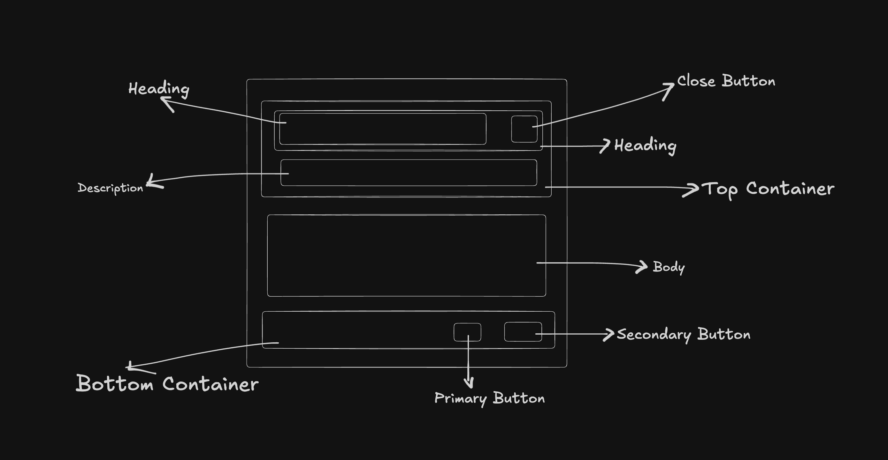

# PopoverV2 Component Documentation

## Requirements

Create a scalable Popover component that can display:

- **Trigger**: Custom trigger element (e.g. button) that opens the popover on click
- **Header**: Optional heading and description with close button
- **Body**: Custom React content (children)
- **Footer**: Optional primary and secondary action buttons
- **Sizes**: Small (sm), Medium (md), and Large (lg) for typography and spacing
- **Positioning**: Configurable side (top, right, bottom, left), align (start, center, end), and offsets
- **Controlled / Uncontrolled**: Support for controlled `open` with `onOpenChange`, or internal state
- **Modal Mode**: Optional modal behavior with backdrop and focus trap
- **Mobile**: Drawer experience on viewport &lt; 1024px when `useDrawerOnMobile` is true
- **Skeleton**: Optional loading state for header, body, and footer
- **Accessibility**: Full ARIA support (aria-labelledby, aria-describedby, aria-label fallback), keyboard (Escape, focus management), and theme support

## Anatomy

```
┌─────────────────────────────────────────────────────────────┐
│  [Trigger]  (click opens popover)                            │
└─────────────────────────────────────────────────────────────┘
                    │
                    ▼
┌─────────────────────────────────────────────────────────────┐
│  Heading                                    [Close]         │
│  Description                                                │
├─────────────────────────────────────────────────────────────┤
│  Body (children)                                             │
│  …                                                           │
├─────────────────────────────────────────────────────────────┤
│                    [Secondary]  [Primary]                    │
└─────────────────────────────────────────────────────────────┘
```



- **Trigger**: Rendered as child of Radix Trigger; receives ref and opens popover on click
- **Surface**: Animated container (Block) with background, border, shadow, and padding from tokens
- **Header**: Optional; heading (span), description (span), and close button (aria-label="Close popover"). Omitted when no heading/description; padding is zero when custom-only content
- **Body**: Children rendered between header and footer; supports skeleton placeholder
- **Footer**: Optional; primary and secondary action buttons (Button with subType INLINE). Omitted when no actions

## Props & Types

```typescript
export enum PopoverV2Size {
    SM = 'sm',
    MD = 'md',
    LG = 'lg',
}

export enum PopoverV2Side {
    TOP = 'top',
    RIGHT = 'right',
    BOTTOM = 'bottom',
    LEFT = 'left',
}

export enum PopoverV2Align {
    START = 'start',
    CENTER = 'center',
    END = 'end',
}

export type PopoverV2ActionType = Omit<
    ButtonProps,
    'buttonGroupPosition' | 'subType'
>

export type PopoverV2SkeletonProps = {
    show?: boolean
    variant?: SkeletonVariant
    bodySkeletonProps?: {
        show?: boolean
        width?: string
        height?: string | number
    }
}

export type PopoverV2Dimensions = {
    width?: number
    maxWidth?: number
    minWidth?: number
    height?: number
    minHeight?: number
    maxHeight?: number
}

export type PopoverV2Props = {
    heading?: string
    description?: string
    trigger: React.ReactNode
    children: React.ReactNode
    showCloseButton?: boolean
    onOpenChange?: (open: boolean) => void
    open?: boolean
    asModal?: boolean
    primaryAction?: PopoverV2ActionType
    secondaryAction?: PopoverV2ActionType
    sideOffset?: number
    side?: PopoverV2Side
    align?: PopoverV2Align
    alignOffset?: number
    size?: PopoverV2Size
    onClose?: () => void
    useDrawerOnMobile?: boolean
    avoidCollisions?: boolean
    skeleton?: PopoverV2SkeletonProps
} & PopoverV2Dimensions &
    Omit<React.HTMLAttributes<HTMLDivElement>, 'slot' | 'className' | 'style'>
```

Dimension props (`width`, `minWidth`, `maxWidth`, `height`, `minHeight`, `maxHeight`) and other div attributes come from `PopoverV2Dimensions` and the `HTMLAttributes` intersection. `zIndex` and `shadow` are token-driven, not props.

## Final Token Type

```typescript
export type PopoverV2TokenType = {
    background: CSSObject['backgroundColor']
    border: CSSObject['border']
    shadow: FoundationTokenType['shadows']
    gap: { [key in PopoverV2Size]: CSSObject['gap'] }
    zIndex: CSSObject['zIndex']
    borderRadius: { [key in PopoverV2Size]: CSSObject['borderRadius'] }
    padding: {
        left: { [key in PopoverV2Size]: CSSObject['paddingLeft'] }
        right: { [key in PopoverV2Size]: CSSObject['paddingRight'] }
        top: { [key in PopoverV2Size]: CSSObject['paddingTop'] }
        bottom: { [key in PopoverV2Size]: CSSObject['paddingBottom'] }
    }
    TopContainer: {
        gap: { [key in PopoverV2Size]: CSSObject['gap'] }
        heading: {
            color: CSSObject['color']
            fontSize: { [key in PopoverV2Size]: CSSObject['fontSize'] }
            fontWeight: { [key in PopoverV2Size]: CSSObject['fontWeight'] }
            lineHeight: { [key in PopoverV2Size]: CSSObject['lineHeight'] }
            IconSize: { [key in PopoverV2Size]: CSSObject['size'] }
        }
        description: {
            color: CSSObject['color']
            fontSize: { [key in PopoverV2Size]: CSSObject['fontSize'] }
            fontWeight: { [key in PopoverV2Size]: CSSObject['fontWeight'] }
            lineHeight: { [key in PopoverV2Size]: CSSObject['lineHeight'] }
        }
    }
    bottomContainer: {
        gap: { [key in PopoverV2Size]: CSSObject['gap'] }
    }
}

export type ResponsivePopoverV2Tokens = {
    [key in keyof BreakpointType]: PopoverV2TokenType
}
```

**Token pattern**: `component.[target].CSSProp.[size].value` with responsive breakpoints (sm, lg).

## Design Decisions

### 1. Radix UI Popover for Desktop

**Decision**: Use `@radix-ui/react-popover` for the desktop experience (viewport ≥ 1024px).

**Rationale**: Radix provides accessible, keyboard-friendly behavior (Escape to close, focus management), positioning with collision avoidance, and portal rendering. Reduces custom logic and keeps behavior consistent with other Radix-based components.

```tsx
<RadixPopover.Root
    open={isOpen}
    onOpenChange={handleOpenChange}
    modal={asModal}
>
    <RadixPopover.Trigger asChild>{trigger}</RadixPopover.Trigger>
    <RadixPopover.Portal>
        <RadixPopover.Content
            side={side}
            align={align}
            sideOffset={sideOffset}
            avoidCollisions={avoidCollisions}
            asChild
        >
            <AnimatedPopoverSurface>…</AnimatedPopoverSurface>
        </RadixPopover.Content>
    </RadixPopover.Portal>
</RadixPopover.Root>
```

### 2. Mobile Drawer (MobilePopoverV2)

**Decision**: When `innerWidth < 1024` and `useDrawerOnMobile` is true, render `MobilePopoverV2` instead of Radix Popover.

**Rationale**: Full-screen or bottom drawer patterns are better on small screens than floating popovers. Single component API; behavior switches by viewport via `useBreakpoints`.

```tsx
if (isMobile && useDrawerOnMobile) {
    return (
        <MobilePopoverV2
            open={isOpen}
            onOpenChange={handleOpenChange}
            onClose={handleClose}
            trigger={trigger}
            size={size}
            …
        >
            {children}
        </MobilePopoverV2>
    )
}
```

### 3. Controlled and Uncontrolled Mode

**Decision**: Support both modes. When `open` is provided, sync internal state via `useEffect` and rely on `onOpenChange` for updates.

**Rationale**: Uncontrolled is simple for most cases; controlled allows parent to drive open state (e.g. from another button or URL). Exposing `onOpenChange` keeps controlled usage complete and avoids “partially controlled” warnings.

```tsx
const [isOpen, setIsOpen] = useState(() => open ?? false)

useEffect(() => {
    if (open !== undefined) setIsOpen(open)
}, [open])

// onOpenChange passed to Root / MobilePopoverV2 so parent can sync when controlled
```

### 4. Custom-Content-Only Layout

**Decision**: When there is no heading, description, primaryAction, or secondaryAction, treat as “custom popover”: header and footer are omitted, and padding is set to 0 so the surface acts as a plain wrapper for `children`.

**Rationale**: Supports use cases like color pickers or custom widgets that need no header/close or footer. Single component covers both “dialog-style” and “custom panel” patterns.

```tsx
const isCustomPopover =
    !heading && !description && !primaryAction && !secondaryAction

// Padding from tokens only when not custom
paddingLeft: isCustomPopover ? 0 : popoverTokens.padding.left[size]
```

### 5. ARIA and Accessibility

**Decision**: Set `aria-labelledby` when heading exists (with stable `headingId` from `useId`), `aria-describedby` when description exists, and `aria-label` fallback (e.g. heading or "Popover dialog") when there is no heading.

**Rationale**: Meets WCAG 4.1.2 (Name, Role, Value). Screen readers get a clear name and optional description. Close button uses `aria-label="Close popover"` for an explicit accessible name.

```tsx
const headingId = heading ? `${baseId}-heading` : undefined
const descriptionId = description ? `${baseId}-description` : undefined

<AnimatedPopoverSurface
    {...(headingId ? { 'aria-labelledby': headingId } : { 'aria-label': heading || 'Popover dialog' })}
    {...(descriptionId ? { 'aria-describedby': descriptionId } : {})}
>
```

### 6. Sub-Components and Skeleton

**Decision**: Split into `PopoverV2Header`, `PopoverV2Footer`, and `PopoverV2Skeleton`. Header and footer can render skeleton placeholders when `skeleton.show` is true.

**Rationale**: Clear separation of concerns; header/footer/skeleton are testable and token-driven. Loading state is consistent and avoids layout shift when content is fetched.

### 7. Theming and Tokens

**Decision**: Use `useResponsiveTokens<PopoverV2TokenType>('POPOVERV2')` with light/dark token variants and breakpoint-based responsive tokens.

**Rationale**: Aligns with design-system token architecture; size and theme are centralized so PopoverV2 stays consistent across apps and themes.
