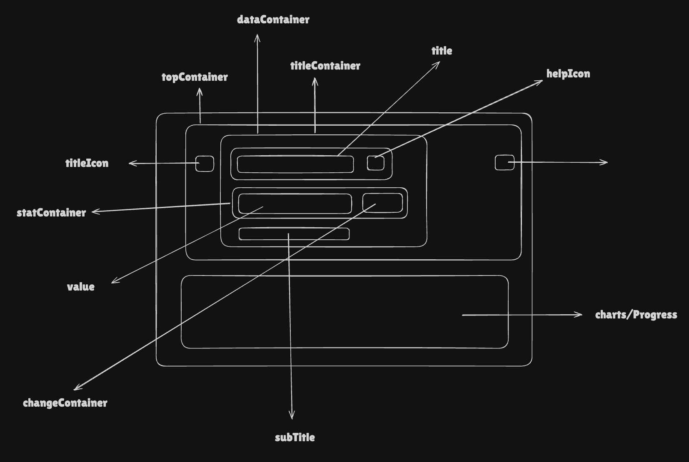

# StatCardV2 Component Documentation

## Requirements

Create a composable, accessible Stat Card component that can display:

- **Title**: Required label for the metric, with an optional inline icon and help tooltip
- **Value**: The primary metric value (e.g. `$8,234`, `83.24%`). Shows a `--` fallback when absent
- **Change**: Optional delta indicator with directional arrow, left/right symbols, and increase/decrease colouring
- **Subtitle**: Optional secondary label (e.g. "Last 24 hours"), hidden on small screens
- **Variants**: Three distinct display modes — `NUMBER`, `CHART`, and `PROGRESS_BAR`
- **Chart**: Renders a `ChartV2` component when `variant=CHART` and chart series data is present
- **Progress Bar**: Renders a `ProgressBar` component when `variant=PROGRESS_BAR` and `progressValue` is provided
- **No-data state**: A dedicated fallback card rendered when none of `value`, `change`, `progressValue`, or chart data is present
- **Skeleton**: Loading placeholder that hides content while data is being fetched
- **Dropdown (mobile)**: `SingleSelect` rendered below the value on small screens, replacing the subtitle, to allow in-card filtering
- **Action Icon**: Optional icon anchored to the top-right corner (hidden on small screens)
- **Title Icon**: Optional icon rendered beside the title (hidden on small screens)
- **Responsive Design**: Layout adapts between `sm` and `md` breakpoints using `useBreakpoints` and `useResponsiveTokens`
- **Accessibility**: Designed with WCAG guidelines in mind, including use of `role="region"`, `role="img"` on charts, `aria-label`, `aria-labelledby`, `aria-describedby`, and unique IDs via `useId`
- **Theme Support**: Light and dark mode token support

---

## Anatomy

```
┌──────────────────────────────────────────────────────────────┐
│  [TitleIcon]  [Title]  [HelpIcon]          [ActionIcon]       │
│                                                               │
│               [Value]  [↑ Change]                            │
│               [Subtitle | Dropdown (sm)]                     │
│                                                               │
│  ────────────────────────────────────────────────────────    │
│  [Chart / ProgressBar / Fallback "--"]                       │
└──────────────────────────────────────────────────────────────┘
```



- **Root Container** (`role="region"`): Main card with border, background, padding, and shadow. Carries `aria-label`, `aria-labelledby`, and `aria-describedby`.
- **Top Container**: Flex row/column holding the title icon, data container, and the absolutely-positioned action icon.
- **Data Container**: Vertical stack holding the title row and the stats + subtitle/dropdown row.
- **Title Container** (`data-element="statcard-header"`): Inline flex row for the metric label and optional help icon button.
- **Stats Container**: Inline flex row holding value and change side by side.
- **Value** (`data-element="statcard-data"`): Primary metric number or string. Renders `--` when empty.
- **Change** (`data-element="statcard-delta"`): Arrow icon + formatted delta text with `data-status="increase|decrease"`.
- **Subtitle** (`data-element="statcard-subtitle"`): Secondary label shown below stats, hidden on `sm`.
- **Dropdown** (`SingleSelect`): Replaces subtitle on `sm` when `dropdownProps` is provided.
- **Chart Block** (`role="img"`): Wraps `ChartV2` with an accessible `aria-label` of `"<title> chart"`.
- **Progress Bar**: Renders the `ProgressBar` component at the bottom of the card.
- **Fallback** (`--`): Rendered in place of a chart or progress bar when their data is absent.
- **No-data Card** (`StatCardV2NoData`): Separate component rendered instead of the full card when all data props are empty.
- **Skeleton** (`StatCardV2Skeleton`): Pulse/wave placeholder rendered inside the region when `skeleton.show` is `true`.

---

## Props & Types

```typescript
// ── Enums ─────────────────────────────────────────────────────────────────────

enum StatCardV2Variant {
    NUMBER = 'number',
    CHART = 'chart',
    PROGRESS_BAR = 'progress',
}

enum StatCardV2ChangeType {
    INCREASE = 'increase',
    DECREASE = 'decrease',
}

enum StatCardV2ArrowDirection {
    UP = 'up',
    DOWN = 'down',
}

enum StatCardV2Alignment {
    LEFT = 'left',
    CENTER = 'center',
}

// ── Compound types ────────────────────────────────────────────────────────────

type StatCardV2Change = {
    value: string // Formatted delta value, e.g. "10.00"
    changeType: StatCardV2ChangeType // Colour and arrow colouring
    leftSymbol?: string // Prefix, e.g. "+" or "-"
    rightSymbol?: string // Suffix, e.g. "%"
    arrowDirection?: StatCardV2ArrowDirection // Defaults to UP
    tooltip?: ReactNode // Optional change tooltip content
}

type StatCardV2SkeletonProps = {
    show: boolean
    variant: SkeletonVariant // e.g. 'pulse' | 'wave'
    height?: CSSObject['height']
    maxWidth?: CSSObject['maxWidth']
    minWidth?: CSSObject['minWidth']
}

type StatCardV2Dimensions = {
    width?: CSSObject['width'] // Defaults to '100%'
    maxWidth?: CSSObject['maxWidth']
    minWidth?: CSSObject['minWidth']
    height?: CSSObject['height'] // Overrides token height on md+
}

// ── Main Props ────────────────────────────────────────────────────────────────

type StatCardV2Props = {
    title: string // Required. Card label / metric name
    variant?: StatCardV2Variant // Defaults to NUMBER
    titleIcon?: ReactNode // Icon beside title; hidden on sm
    actionIcon?: ReactNode // Top-right icon; hidden on sm
    helpIconText?: string // Tooltip text for the help icon
    value?: string // Primary metric value
    progressValue?: number // 0–100; required for PROGRESS_BAR variant
    change?: StatCardV2Change // Delta badge
    subtitle?: string // Secondary label below value
    options?: ChartV2Options // Highcharts options for CHART variant
    skeleton?: StatCardV2SkeletonProps // Loading state
    dropdownProps?: SingleSelectProps // In-card filter dropdown (mobile only)
    alignment?: StatCardV2Alignment // LEFT or CENTER alignment (md+ only)
    dataDisplay?: boolean // Reserved for toggling data sections
} & HTMLAttributes<HTMLDivElement> &
    StatCardV2Dimensions
```

### Sub-component Props

```typescript
// Used internally; not exposed as a public API.

type StatCardV2TitleProps = {
    title: string
    helpIconText?: string
    tokens: StatCardV2TokensType
    id?: string // Passed from parent for aria-labelledby
}

type StatCardV2ChangeProps = {
    changeValueText?: string
    leftSymbol?: string
    rightSymbol?: string
    arrowDirection: StatCardV2ArrowDirection
    changeType: StatCardV2ChangeType
    tokens: StatCardV2TokensType
    id?: string
}

type StatCardV2SubtitleProps = {
    subtitle?: string
    tokens: StatCardV2TokensType
    id?: string // Passed from parent for aria-describedby
}
```

---

## Final Token Type

```typescript
type StatCardV2TokensType = {
    // Card container
    height: CSSObject['height']
    width: CSSObject['width']
    maxWidth: CSSObject['maxWidth']
    minWidth: CSSObject['minWidth']
    paddingTop: CSSObject['paddingTop']
    paddingBottom: CSSObject['paddingBottom']
    paddingLeft: CSSObject['paddingLeft']
    paddingRight: CSSObject['paddingRight']
    border: CSSObject['border']
    borderRadius: CSSObject['borderRadius']
    backgroundColor: CSSObject['backgroundColor']
    boxShadow: CSSObject['boxShadow']

    topContainer: {
        gap: CSSObject['gap'] // Gap between titleIcon and dataContainer

        dataContainer: {
            gap: CSSObject['gap'] // Gap between title row and stats row

            titleContainer: {
                gap: CSSObject['gap'] // Gap between title text and helpIcon
                title: {
                    fontSize: CSSObject['fontSize']
                    fontWeight: CSSObject['fontWeight']
                    color: CSSObject['color']
                    lineHeight: CSSObject['lineHeight']
                }
                helpIcon: {
                    width: CSSObject['width']
                    height: CSSObject['height']
                    color: {
                        default: CSSObject['color']
                        hover: CSSObject['color']
                    }
                }
            }

            statsContainer: {
                gap: CSSObject['gap'] // Gap between value and change

                // Typography per variant — NUMBER / CHART / PROGRESS_BAR
                value: {
                    [key in StatCardV2Variant]: {
                        fontSize: CSSObject['fontSize']
                        fontWeight: CSSObject['fontWeight']
                        color: CSSObject['color']
                        lineHeight: CSSObject['lineHeight']
                    }
                }

                changeContainer: {
                    gap: CSSObject['gap'] // Gap between arrow and change text
                    change: {
                        fontSize: CSSObject['fontSize']
                        fontWeight: CSSObject['fontWeight']
                        lineHeight: CSSObject['lineHeight']
                        color: {
                            [key in StatCardV2ChangeType]: CSSObject['color']
                        }
                    }
                    arrow: {
                        width: CSSObject['width']
                        height: CSSObject['height']
                        color: {
                            [key in StatCardV2ChangeType]: CSSObject['color']
                        }
                    }
                }
            }

            subtitle: {
                fontSize: CSSObject['fontSize']
                fontWeight: CSSObject['fontWeight']
                color: CSSObject['color']
                lineHeight: CSSObject['lineHeight']
            }
        }
    }
}

// Responsive wrapper — tokens are breakpoint-scoped
type ResponsiveStatCardV2Tokens = {
    [key in keyof BreakpointType]: StatCardV2TokensType
}
```

**Token Pattern**: `component.container.element.CSSProp.[variant].[state]`

---

## Design Decisions

### 1. Component Composition with Dedicated Sub-components

**Decision**: Split rendering into focused sub-components — `StatCardV2Title`, `StatCardV2Value`, `StatCardV2Change`, `StatCardV2Subtitle`, `StatCardV2Skeleton`, `StatCardV2NoData`.

**Rationale**: Each sub-component owns a single concern. This keeps the main `StatCardV2` component slim and makes individual pieces independently testable. Token consumption is also localised — only the sub-component that needs a token shape accesses it.

```tsx
<StatCardV2Title  id={titleId}   title={title}  tokens={tokens} />
<StatCardV2Value  id={valueId}   value={value}  tokens={tokens} variant={variant} />
<StatCardV2Change id={changeId}  changeValueText={change?.value} tokens={tokens} ... />
<StatCardV2Subtitle id={subtitleId} subtitle={subtitle} tokens={tokens} />
```

---

### 2. Early-Return No-data Card

**Decision**: When none of `value`, `change`, `progressValue`, or chart series data is present (and `skeleton.show` is `false`), the component returns a lightweight `StatCardV2NoData` component instead of the full card.

**Rationale**: Avoids rendering an empty card that would confuse users. The no-data card reuses the same layout chrome (border, padding, tokens) but centres a `--` placeholder and never renders the variant-specific section. This keeps the empty state explicit and testable.

```tsx
if (!skeleton?.show && !value && !change && !progressValue && !hasChartData) {
    return <StatCardV2NoData ... />
}
```

---

### 3. Responsive Height Resolution

**Decision**: The `height` prop is only honoured on `md` and larger screens. On `sm` the token-defined height always takes over.

**Rationale**: On mobile the card sits in a narrower column and a fixed caller-supplied height can cause overflow. The token height is designed for the `sm` breakpoint layout, so using it unconditionally on small screens guarantees visual consistency.

```tsx
const resolvedHeight = !isSmallScreen && height ? height : tokens.height
```

---

### 4. Chart Data Guard (`hasChartData`)

**Decision**: Before rendering `ChartV2`, the component inspects the `options.series` array to confirm at least one series has non-empty `data`.

**Rationale**: Highcharts renders an empty, blank chart area when passed empty series, which looks broken. Guarding against this and falling through to `renderVariantFallbackValue` gives the caller a clean `--` placeholder instead.

```tsx
const hasChartData =
    isChartVariant &&
    options?.series?.some(s => Array.isArray(s?.data) && s.data.length > 0)

{hasChartData ? <ChartV2 ... /> : renderVariantFallbackValue(tokens, variant)}
```

---

### 5. Mobile Dropdown Replaces Subtitle

**Decision**: On small screens (`isSmallScreen === true`), the subtitle is hidden and a `SingleSelect` dropdown is rendered in its place when `dropdownProps` are provided. This applies to both the main card and the no-data card.

**Rationale**: Mobile stat cards are often used in dashboards where the user needs to switch the dimension (e.g. Currency, Region). The dropdown replaces the subtitle rather than stacking below it to avoid vertical overflow in compact card grids. The `NO_CONTAINER` / `SMALL` `SingleSelect` variant ensures it blends visually.

```tsx
// Main card
{isSmallScreen && items && items.length > 0 && (
    <SingleSelect variant={SelectMenuVariant.NO_CONTAINER} size={SelectMenuSize.SMALL} inline ... />
)}

// No-data card — same logic; dropdownProps must be forwarded explicitly
{isSmallScreen && dropdownProps?.items?.length > 0 && (
    <SingleSelect ... />
)}
```

---

### 6. Action Icon and Title Icon Hidden on Mobile

**Decision**: `actionIcon` and `titleIcon` are suppressed on `sm` screens.

**Rationale**: Mobile cards have limited horizontal space. The action icon (typically a popover or settings trigger) and the decorative title icon would crowd the metric value which is the most important element. Removing them on mobile keeps the card scannable.

```tsx
{
    actionIcon && !isSmallScreen && (
        <Block data-element="action-icon" position="absolute" right={0} top={0}>
            {actionIcon}
        </Block>
    )
}
{
    titleIcon && !isSmallScreen && titleIcon
}
```

---

### 7. Comprehensive WCAG Accessibility

**Decision**: The root card has `role="region"` with both `aria-label` (a human-readable description built from title, value, subtitle, and change) and `aria-labelledby` pointing to the title element's ID. The subtitle ID is wired to `aria-describedby` when present. The chart wrapper carries `role="img"` with a contextual `aria-label`.

**Rationale**: `role="region"` turns the card into a named landmark, making it navigable by keyboard and screen-reader users. `aria-labelledby` ensures the visible title text is read when focus enters. `aria-label` provides a richer summary for AT that reads the full state ("Approval rate, 83.24%, Last 24 hours, increased by +10.00%").

```tsx
<Block
    role="region"
    aria-label={cardLabel || title}      // Computed by buildStatCardV2AriaLabel()
    aria-labelledby={titleId}
    aria-describedby={subtitle ? subtitleId : undefined}
>
```

---

### 8. Unique ID Generation via `useId`

**Decision**: A single `baseId` is generated with `useId()` and namespaced suffixes are derived from it (`-title`, `-value`, `-change`, `-subtitle`, `-chart`).

**Rationale**: Multiple `StatCardV2` instances on the same page need collision-free IDs for ARIA relationships to work. React's `useId` guarantees uniqueness per component instance without needing a global counter or UUID library.

```tsx
const baseId = useId()
const titleId = `${baseId}-title`
const subtitleId = `${baseId}-subtitle`
// passed as `id` props to sub-components and referenced in aria-* attributes
```

---

### 9. ARIA Label Built in a Utility Function

**Decision**: The `aria-label` string is computed by `buildStatCardV2AriaLabel()` extracted into `utils.ts`, and memoised with `useMemo`.

**Rationale**: Building the label inline would mix presentation logic into the component body and makes it harder to test in isolation. The utility is a pure function that can be unit tested independently. `useMemo` avoids re-computing on unrelated renders.

```tsx
// utils.ts
export const buildStatCardV2AriaLabel = ({
    title,
    value,
    subtitle,
    change,
}) => {
    // → "Approval rate, 83.24%, Last 24 hours, increased by +10.00%"
}

// StatCardV2.tsx
const cardLabel = useMemo(
    () => buildStatCardV2AriaLabel({ title, value, subtitle, change }),
    [title, value, subtitle, change]
)
```

---

### 10. Variant-keyed Value Typography

**Decision**: Value font tokens are keyed by `StatCardV2Variant` inside `statsContainer.value`.

**Rationale**: The NUMBER variant typically shows a large headline figure, while CHART and PROGRESS_BAR variants may display a smaller supplementary value. Using a variant key in the token map allows designers to set different sizes per variant without conditional logic in the component.

```typescript
statsContainer: {
    value: {
        number:       { fontSize, fontWeight, color, lineHeight },
        chart:        { fontSize, fontWeight, color, lineHeight },
        progress:     { fontSize, fontWeight, color, lineHeight },
    }
}
```

---

### 11. Change Type-keyed Colours

**Decision**: Both arrow and text colours in the change container are keyed by `StatCardV2ChangeType` in the token map.

**Rationale**: Increase/decrease colouring (green/red) is a core part of the component's semantic meaning. Encoding it in tokens rather than hardcoding colours in the component keeps it themeable and makes dark-mode overrides straightforward.

```typescript
changeContainer: {
    change: { color: { increase: '...', decrease: '...' } },
    arrow:  { color: { increase: '...', decrease: '...' } },
}
```

---

### 12. Filter Blocked Props

**Decision**: Rest props are passed through `filterBlockedProps` before being spread onto the root `Block`.

**Rationale**: Prevents component-internal prop names (or blocked HTML attributes) from leaking to the DOM and causing React warnings or unexpected behaviour, while still allowing callers to attach native `data-*`, `id`, `className`, and event handlers.

```tsx
const filteredProps = filterBlockedProps(props)
<Block {...filteredProps} />
```
