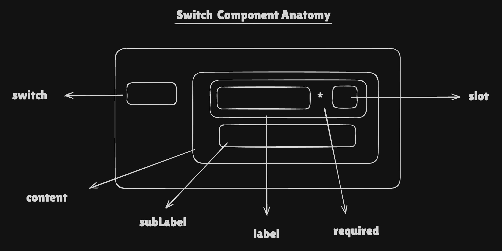

# SwitchV2 Component Documentation

## Requirements

Create a scalable Switch component that can display:

- **Toggle State**: Support for checked/unchecked states with smooth animations
- **Label & SubLabel**: Primary label with optional sub-label text
- **Text Truncation**: Configurable max length for label and sub-label with tooltip support
- **Icon Slot**: Optional icon slot next to the label
- **Sizes**: Small (sm) and Medium (md)
- **States**: Default, hover, disabled, error
- **Accessibility**: Full ARIA support with proper roles, labels, and descriptions
- **Theme Support**: Light and dark theme variants
- **Required Indicator**: Visual asterisk for required fields
- **Error State**: Visual error indication with proper ARIA attributes

## Anatomy

```
┌─────────────────────────────────────────────────────────────┐
│  ┌─────────────┐  ┌─────────────────────────────────────┐   │
│  │   [Track]   │  │  Label Text [Icon]                   │  │
│  │   [Thumb]   │  │  Sub Label Text                      │  │
│  └─────────────┘  └─────────────────────────────────────┘   │
└─────────────────────────────────────────────────────────────┘
```



- **Container**: Flex container with gap between switch and content
- **Switch Track**: Rounded button element with background color based on checked state
- **Switch Thumb**: Circular thumb that slides horizontally based on checked state
- **Label**: Primary text label with optional required asterisk
- **Icon Slot**: Optional ReactElement icon displayed next to label
- **SubLabel**: Secondary descriptive text below the label

## Props & Types

```typescript
export type SwitchV2Props = {
    checked?: boolean
    onChange?: (checked: boolean) => void
    required?: boolean
    error?: boolean
    label?: string
    subLabel?: string
    size?: SwitchV2Size
    slot?: {
        slot: ReactElement
        maxHeight?: CSSObject['maxHeight']
    }
    maxLength?: {
        label?: number
        subLabel?: number
    }
} & Omit<
    ButtonHTMLAttributes<HTMLButtonElement>,
    'className' | 'style' | 'slot' | 'onChange'
>
```

## Final Token Type

```typescript
export type SwitchV2TokensType = {
    gap: CSSObject['gap']
    switch: {
        height: {
            [key in SwitchV2Size]: CSSObject['height']
        }
        width: {
            [key in SwitchV2Size]: CSSObject['width']
        }
        backgroundColor: {
            [key in SwitchV2Variant]: {
                [key in SwitchV2State]: CSSObject['backgroundColor']
            }
        }
        thumb: {
            backgroundColor: CSSObject['backgroundColor']
            border: CSSObject['border']
            width: {
                [key in SwitchV2Size]: CSSObject['width']
            }
            height: {
                [key in SwitchV2Size]: CSSObject['height']
            }
            outline: CSSObject['outline']
        }
    }
    content: {
        label: {
            gap: CSSObject['gap']
            color: {
                [key in SwitchV2State]: CSSObject['color']
            }
            fontSize: { [key in SwitchV2Size]: CSSObject['fontSize'] }
            fontWeight: { [key in SwitchV2Size]: CSSObject['fontWeight'] }
            lineHeight: { [key in SwitchV2Size]: CSSObject['lineHeight'] }
            slot: {
                maxHeight: CSSObject['maxHeight']
            }
        }
        subLabel: {
            color: {
                [key in SwitchV2State]: CSSObject['color']
            }
            fontSize: { [key in SwitchV2Size]: CSSObject['fontSize'] }
            fontWeight: { [key in SwitchV2Size]: CSSObject['fontWeight'] }
            lineHeight: { [key in SwitchV2Size]: CSSObject['lineHeight'] }
        }
        required: {
            color: CSSObject['color']
        }
    }
}

export type ResponsiveSwitchV2Tokens = {
    [key in keyof BreakpointType]: SwitchV2TokensType
}
```

**Token Pattern**: `component.[target].CSSProp.[size].[variant/state].value`

## Design Decisions

### 1. Component Separation for Maintainability

**Decision**: Split SwitchV2 into three sub-components: `SwitchV2Button`, `SwitchV2Content`, and the main `SwitchV2` wrapper.

**Rationale**: Improves code organization, testability, and reusability. Each component has a single responsibility:

- `SwitchV2Button`: Handles the toggle mechanism and thumb animation
- `SwitchV2Content`: Manages label, sub-label, and slot rendering
- `SwitchV2`: Orchestrates the overall component and handles accessibility

```tsx
<SwitchV2Button {...buttonProps} />
<SwitchV2Content {...contentProps} />
```

### 2. Reusable Selector Components

**Decision**: Use shared `SelectorsLabel` and `SelectorsSubLabel` components instead of inline implementations.

**Rationale**: Enables code reuse across Switch, Radio, and Checkbox components. Centralizes truncation logic, tooltip handling, and accessibility features. Reduces duplication and ensures consistent behavior across selector components.

```tsx
<SelectorsLabel
    uniqueId={uniqueId}
    disabled={disabled}
    error={error}
    required={required}
    size={size}
    label={label ?? ''}
    tokens={tokens}
    maxLength={labelMaxLength}
/>
```

### 3. Text Truncation with Tooltip

**Decision**: Implement automatic text truncation with tooltip display when text exceeds `maxLength`.

**Rationale**: Prevents layout breaking with long text while preserving accessibility. Users can still see full text via tooltip on hover. Uses `getTruncatedText` utility for consistent truncation behavior.

```tsx
const { truncatedValue, fullValue, isTruncated } = getTruncatedText(
    label,
    maxLength
)

return isTruncated ? <Tooltip content={fullValue}>{content}</Tooltip> : content
```

### 4. ARIA Attributes and Accessibility

**Decision**: Comprehensive ARIA support with `aria-checked`, `aria-required`, `aria-invalid`, `aria-disabled`, and `aria-describedby`.

**Rationale**: Ensures proper screen reader support and keyboard navigation. Follows WCAG 2.1 guidelines for form controls. Uses `getSubtextId` and `mergeAriaDescribedBy` utilities to properly link sub-label descriptions.

```tsx
const ariaAttributes = {
    'aria-required': required || undefined,
    'aria-invalid': error || undefined,
    'aria-disabled': disabled || undefined,
    'aria-describedby': mergeAriaDescribedBy(subLabelId, customAriaDescribedBy),
}
```
