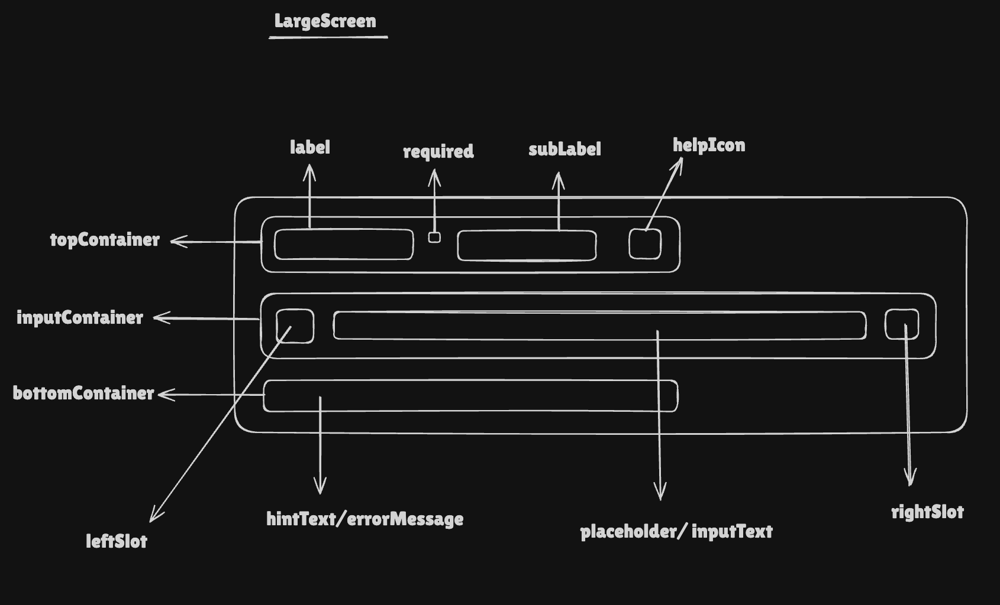

# TextInputV2 Component Documentation

## Requirements

Create a scalable text input component that supports:

- **Controlled value**: Single source of truth via `value` and `onChange`
- **Labels**: Primary label, optional subLabel (e.g. “As it appears on your ID”)
- **Sizes**: Small (`sm`), Medium (`md`), Large (`lg`)
- **States**: Default, hover, focus, error, disabled — with correct borders and backgrounds
- **Validation**: Error state with optional message; required indicator (asterisk)
- **Help**: Hint text below input; optional help icon with tooltip (`helpIconText`)
- **Slots**: Left and right slots (e.g. icons, clear button) with configurable `maxHeight`
- **Responsive behavior**: On small screens with large size, labels can float inside the input
- **Accessibility**: Native `<input>`, `aria-required`, `aria-invalid`, `aria-describedby` for error/hint, focus ring
- **Ref forwarding**: Support both internal ref (autofill, layout) and consumer ref
- **Theme**: Light/dark tokens via `useResponsiveTokens('TEXT_INPUTV2')`

## Anatomy

```
┌─────────────────────────────────────────────────────────────┐
│  [Top container: Label, SubLabel, Required *, Help icon]   │
├─────────────────────────────────────────────────────────────┤
│  [LeftSlot]  │  [Floating label or placeholder]  │ [RightSlot]  │  ← input row
├─────────────────────────────────────────────────────────────┤
│  [Bottom: Hint text / Error message]                       │
└─────────────────────────────────────────────────────────────┘
```



- **Top container**: Label, subLabel (in parentheses), required asterisk, optional help icon with tooltip
- **Input row**: Optional left slot, native `<input>` (with optional floating label on small + large), optional right slot
- **Bottom container**: Hint text and/or error message; IDs used for `aria-describedby`
- **Floating label**: Shown only when `breakPointLabel === 'sm'` and `size === 'lg'`; animates based on focus/value/autofill

## Props & Types

```typescript
// Shared enums (inputV2.types)
enum InputSizeV2 {
    SM = 'sm',
    MD = 'md',
    LG = 'lg',
}

enum InputStateV2 {
    DEFAULT = 'default',
    HOVER = 'hover',
    FOCUS = 'focus',
    ERROR = 'error',
    DISABLED = 'disabled',
}

type TextInputV2Props = {
    value: string
    label?: string
    subLabel?: string
    size?: InputSizeV2
    error?: {
        show: boolean
        message?: string
    }
    hintText?: string
    helpIconText?: {
        text: string
        onClick?: () => void
    }
    leftSlot?: {
        slot: ReactElement
        maxHeight?: CSSObject['maxHeight']
    }
    rightSlot?: {
        slot: ReactElement
        maxHeight?: CSSObject['maxHeight']
    }
} & Omit<
    React.InputHTMLAttributes<HTMLInputElement>,
    'size' | 'style' | 'className'
>
```

- **Omit `size`**: Avoids conflict with HTML `size` attribute; component uses `InputSizeV2`.
- **Omit `style` | `className`**: Styling is driven by tokens and layout; blocked via `filterBlockedProps(rest)` so consumers cannot override in a way that breaks the design.

## Final Token Type

Tokens are **responsive** per breakpoint (`sm`, `md`, `lg` from `BreakpointType`). Each breakpoint gets a full `TextInputV2TokensType`:

```typescript
type TextInputV2TokensType = {
    gap: CSSObject['gap']
    topContainer: {
        label: {
            fontSize: { [key in InputSizeV2]: CSSObject['fontSize'] }
            fontWeight: { [key in InputSizeV2]: CSSObject['fontWeight'] }
            lineHeight: { [key in InputSizeV2]: CSSObject['lineHeight'] }
            color: { [key in InputStateV2]: CSSObject['color'] }
        }
        subLabel: {
            /* same shape */
        }
        required: { color: CSSObject['color'] }
        helpIcon: {
            width: { [key in InputSizeV2]: CSSObject['width'] }
            color: { [key in InputStateV2]: CSSObject['color'] }
        }
    }
    inputContainer: {
        gap: CSSObject['gap']
        placeholder: {
            color: { [key in InputStateV2]: CSSObject['color'] }
            fontSize: { [key in InputSizeV2]: CSSObject['fontSize'] }
            fontWeight: { [key in InputSizeV2]: CSSObject['fontWeight'] }
            lineHeight: { [key in InputSizeV2]: CSSObject['lineHeight'] }
        }
        inputText: {
            fontSize: { [key in InputSizeV2]: CSSObject['fontSize'] }
            fontWeight: { [key in InputSizeV2]: CSSObject['fontWeight'] }
            lineHeight: { [key in InputSizeV2]: CSSObject['lineHeight'] }
            color: { [key in InputStateV2]: CSSObject['color'] }
        }
        borderRadius: { [key in InputSizeV2]: CSSObject['borderRadius'] }
        boxShadow: CSSObject['boxShadow']
        padding: {
            top: { [key in InputSizeV2]: CSSObject['padding'] }
            right: { [key in InputSizeV2]: CSSObject['padding'] }
            bottom: { [key in InputSizeV2]: CSSObject['padding'] }
            left: { [key in InputSizeV2]: CSSObject['padding'] }
        }
        border: { [key in InputStateV2]: CSSObject['border'] }
        backgroundColor: { [key in InputStateV2]: CSSObject['backgroundColor'] }
    }
    bottomContainer: {
        hintText: {
            fontSize: { [key in InputSizeV2]: CSSObject['fontSize'] }
            fontWeight: { [key in InputSizeV2]: CSSObject['fontWeight'] }
            lineHeight: { [key in InputSizeV2]: CSSObject['lineHeight'] }
            color: { [key in InputStateV2]: CSSObject['color'] }
        }
        errorMessage: {
            fontSize: { [key in InputSizeV2]: CSSObject['fontSize'] }
            fontWeight: { [key in InputSizeV2]: CSSObject['fontWeight'] }
            lineHeight: { [key in InputSizeV2]: CSSObject['lineHeight'] }
            color: CSSObject['color']
        }
    }
}

type ResponsiveTextInputV2Tokens = {
    [key in keyof BreakpointType]: TextInputV2TokensType
}
```

**Token pattern**: `component.[topContainer|inputContainer|bottomContainer].[element].[CSSProp].[size|state].value`. Theme is selected via `getTextInputV2Tokens(foundationToken, theme)` (light/dark).

## Design Decisions

### 1. Error as object `{ show, message? }`

**Decision**: Use `error?: { show: boolean; message?: string }` instead of separate `error: boolean` and `errorMessage: string`.

**Rationale**: Keeps validation state and message co-located, avoids mismatched booleans and strings, and aligns with a single `InputFooterV2` that reads `error.show` and `error.message`.

```tsx
error = { show: false, message: '' }
// ...
<InputFooterV2 error={error.show} errorMessage={error.message} ... />
```

### 2. Vertical padding for floating label (small + large)

**Decision**: When `isSmallScreenWithLargeSize` and the input is focused or has value (or autofilled), increase top padding and reduce bottom padding so the floating label has space and the input stays balanced.

**Rationale**: Floating label moves from center to top; padding is adjusted so the label does not overlap the border and the field height remains consistent. Logic lives in `getVerticalInputPadding()` in `utils.ts`.

```tsx
const { top, bottom } = getVerticalInputPadding({
    isSmallScreenWithLargeSize,
    inputFocusedOrWithValue,
    paddingTop: inputContainerPaddingTop,
    paddingBottom: inputContainerPaddingBottom,
})
// top = inputFocusedOrWithValue ? paddingTop * 1.5 : paddingTop
// bottom = inputFocusedOrWithValue ? paddingBottom / 2 : paddingBottom
```

### 3. Dynamic input padding for left/right slots

**Decision**: Use `useInputSlotPadding` to measure slot refs and set input padding to `basePadding + slotWidth + gap` so text does not overlap icons.

**Rationale**: Slot width is unknown (icons, buttons); measuring at runtime keeps the input field aligned with the visual slot and avoids hard-coded widths.

```tsx
const { calculatedLeftInputPadding, calculatedRightInputPadding } =
    useInputSlotPadding({
        leftSlotRef,
        rightSlotRef,
        hasLeftSlot: Boolean(leftSlot),
        hasRightSlot: Boolean(rightSlot),
        paddingLeft: inputContainerPaddingLeft,
        paddingRight: inputContainerPaddingRight,
        gap: toPixels(container.gap),
    })
```

### 4. Ref callback to support internal + external refs

**Decision**: Use a single ref callback `setInputRef` that assigns both the internal `inputRef` and the consumer’s `ref` (function or object ref).

**Rationale**: Internal ref is needed for autofill detection and layout; consumers may need the DOM node for focus or form libraries. `setExternalRef()` handles both callback refs and `React.RefObject`.

```tsx
const setInputRef = (node: HTMLInputElement | null) => {
    inputRef.current = node
    setExternalRef(ref as AnyRef<HTMLInputElement>, node)
}
// ...
<PrimitiveInput ref={setInputRef} ... />
```

### 5. Autofill detection for floating label

**Decision**: Use `useAutofillDetection(inputRef, setIsAutofilled)` so browser-autofilled value is treated like user input for floating label position.

**Rationale**: Autofill doesn’t fire React’s `onChange`; without detection the label would stay centered over autofilled text. The hook uses `animationstart` for `blend-autofill-start` / `blend-autofill-cancel` (or initial value length) to set `isAutofilled`, which is combined with `value.length` and `isFocused` into `inputFocusedOrWithValue`.

```tsx
const inputFocusedOrWithValue = isFocused || value.length > 0 || isAutofilled
```

### 6. Static vs floating labels by breakpoint and size

**Decision**: Show **static** labels (above the input) unless `breakPointLabel === 'sm'` and `size === InputSizeV2.LG`; in that case hide static labels and show **floating** label inside the input.

**Rationale**: On small viewports with large size, vertical space is limited; a floating label saves space while keeping the field labeled. Other combinations keep the standard “label above input” pattern.

```tsx
const showStaticLabels = !isSmallScreenWithLargeSize
// ...
{showStaticLabels && <InputLabelsV2 ... />}
{label && isSmallScreenWithLargeSize && (
    <FloatingLabelsV2
        isInputFocusedOrWithValue={inputFocusedOrWithValue}
        ...
    />
)}
```

### 7. Blocking `className` and `style`

**Decision**: Spread `...filterBlockedProps(rest)` onto the primitive input so `className` and `style` from props are never passed through.

**Rationale**: Ensures layout and theming are controlled by tokens and internal structure; avoids style overrides that could break padding, focus ring, or accessibility.

```tsx
export function filterBlockedProps<T>(
    props: T
): Omit<T, 'className' | 'style'> {
    const { className, style, ...filtered } = props
    return filtered as Omit<T, 'className' | 'style'>
}
```

### 8. Error overrides hover/focus variants

**Decision**: When `error.show` is true, set `borderVariant`, `hoverVariant`, and `focusVariant` all to `InputStateV2.ERROR` so error state is always visible and not replaced by hover/focus.

**Rationale**: Validation errors should stay visually prominent until the error is cleared, even when the user hovers or focuses the field.

```tsx
const hasError = Boolean(error?.show)
const borderVariant = hasError ? InputStateV2.ERROR : inputState
const hoverVariant = hasError ? InputStateV2.ERROR : InputStateV2.HOVER
const focusVariant = hasError ? InputStateV2.ERROR : InputStateV2.FOCUS
```

### 9. Centralized input state and ARIA

**Decision**: Derive `inputState` with `getInputState(error, disabled)` and build `ariaDescribedBy` from `errorId` and `hintId` so error and hint are associated with the input.

**Rationale**: Single place for “default vs error vs disabled” and for accessible descriptions (WCAG 3.3.1, 3.3.2); input receives `aria-invalid`, `aria-required`, and `aria-describedby` from these values.

```tsx
const inputState = useMemo(
    () => getInputState(error, disabled),
    [error, disabled]
)
const ariaDescribedBy = useMemo(() => {
    const ids = [error?.show && errorId, hintText && hintId].filter(
        Boolean
    ) as string[]
    return ids.length > 0 ? ids.join(' ') : undefined
}, [error?.show, errorId, hintText, hintId])
```

### 10. Placeholder hidden when floating label is shown

**Decision**: When `isSmallScreenWithLargeSize` is true, pass `placeholder=""` to the native input so the floating label is the only “placeholder-like” text.

**Rationale**: Prevents duplicate or overlapping instructions (floating label + placeholder) in the compact layout.

```tsx
placeholder={isSmallScreenWithLargeSize ? '' : placeholder}
```
